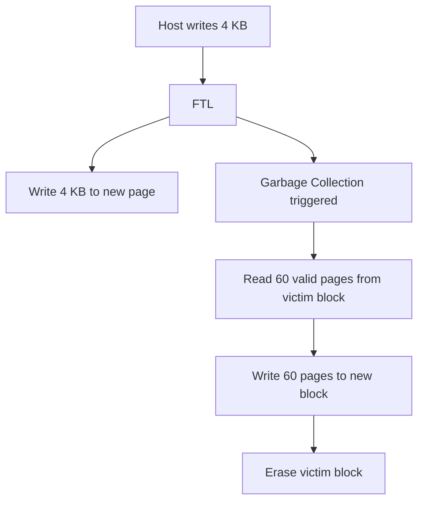

> [!NOTE] Definition
> Write amplification (WA) is the ratio of the total amount of data physically written to flash versus the amount of data the host intended to write. A WA of 3x means that for every 1 GB the host writes, the SSD internally writes 3 GB due to garbage collection, wear leveling, and other FTL operations.

## Formula

$$WA = \frac{\text{Physical data written to flash}}{\text{Logical data written by host}}$$

Ideal: $WA = 1.0$ (no amplification). Real-world: typically $2\times$ to $10\times$.

## Causes

1. **Garbage collection** in the [[Flash Translation Layer]]: copying valid pages from victim blocks before erasing
2. **[[Wear Leveling]]**: moving cold data to redistribute write load
3. **Partial block writes**: writing less than a full block still triggers read-modify-write internally
4. **Misaligned writes**: writes not aligned to page boundaries

In this example, a 4 KB host write caused 244 KB of additional writes (60 pages x 4 KB), giving $WA \approx 61$.

## Impact

| High WA Causes | Consequence |
|---|---|
| Reduced write throughput | SSD busy with internal writes |
| Faster flash wear | More P/E cycles consumed |
| Shorter SSD lifetime | Cells reach endurance limit sooner |

> [!IMPORTANT]
> Database systems can reduce write amplification by using **sequential write patterns**, **large batch writes**, and **log-structured approaches** like [[LSM Tree]]. Random small writes are the worst case for write amplification.

## WAF and Over-Provisioning

Under a uniform random workload, WAF relates to over-provisioning (OP):

$$WAF \approx \frac{1}{2 \times OP}$$

| OP | WAF | Example |
|---|---|---|
| 25% | ~2.0 | Mixed-use SSD |
| 15% | ~3.3 | Read-intensive SSD |
| 50% | ~1.0 | Write-intensive SSD |

> [!WARNING]
> Skewed access patterns (hot/cold data) can **increase** WAF because hot and cold pages mix within blocks, forcing [[SSD Garbage Collection]] to copy more valid pages. Sequential writing alone does not solve this.

## Mitigation Strategies

- **Over-provisioning**: reserve extra flash capacity for GC headroom - don't fill your SSD
- **TRIM support**: tell the FTL about deleted data promptly
- **Hot/cold separation**: keep frequently and infrequently updated data in separate blocks
- **Log-structured writes**: append-only patterns minimize in-place updates
- **ZNS/FDP interfaces**: new SSD interfaces that give the host more control over data placement

## Related Concepts

- [[Flash Translation Layer]]: the component that causes write amplification through garbage collection
- [[SSD Garbage Collection]]: the detailed GC process and its impact on WAF
- [[Wear Leveling]]: contributes to write amplification but extends SSD lifetime
- [[SSD Architecture]]: the hardware context for write amplification
- [[LSM Tree]]: a write-optimized data structure that reduces write amplification
- [[SSD-Aware Database Design]]: strategies to minimize write amplification
