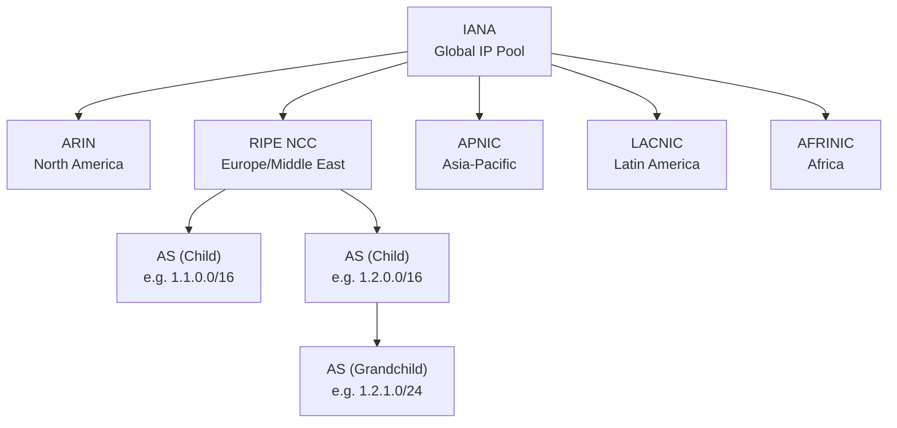

> [!NOTE] Definition
> An Autonomous System (AS) is a collection of IP network prefixes owned and managed by a single entity (e.g., an ISP, university, or corporation) that presents a common routing policy to the Internet.

Each AS is identified by a globally unique **Autonomous System Number (ASN)**, assigned by Regional Internet Registries (RIRs).

## How It Works

The Internet is organized as a network of interconnected ASes. Each AS controls its own internal routing but uses [[Border Gateway Protocol]] (BGP) to exchange reachability information with neighboring ASes via **BGP routers** at the edges.

### IP Address Distribution Hierarchy

IP addresses flow from IANA through a hierarchical delegation:

The five **Regional Internet Registries (RIRs)** are responsible for managing and distributing IP addresses within their geographic areas.

## Example

TU Darmstadt operates its own AS with a unique ASN. It manages a set of IP prefixes and uses BGP to announce reachability of those prefixes to its upstream providers.

## Related Concepts

- [[Border Gateway Protocol]]: the protocol ASes use to exchange routing information
- [[Gao-Rexford Model]]: models business relationships between ASes
- [[Resource Public Key Infrastructure]]: cryptographically binds prefixes to their owning ASN
