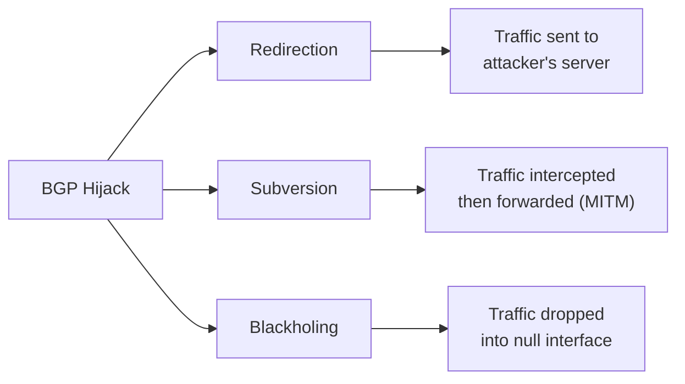

> [!NOTE] Definition
> BGP Hijacking is an attack in which a malicious [[Autonomous System]] announces IP prefixes it does not legitimately own, causing other networks to route traffic through the attacker's network instead of the legitimate destination.

Since [[Border Gateway Protocol|BGP]] has no built-in mechanism to verify the authenticity of announcements, any AS can claim ownership of any prefix. When the fake announcement is accidental (misconfiguration), it is called a **route leak** rather than a hijack.

## Attack Vectors

### 1. Sub-prefix Hijacking

The attacker announces a **more specific** (longer) prefix than the legitimate owner.

| Legitimate | Attacker |
|---|---|
| `139.23.0.0/16` | `139.23.0.0/24` |

Due to [[Border Gateway Protocol|Longest Prefix Match]], all routers on the Internet will prefer the attacker's more specific route. This affects networks globally.

### 2. Same-prefix Hijacking

The attacker announces the **same prefix** as the legitimate owner, often with a shorter AS path.

| Legitimate | Attacker |
|---|---|
| `139.23.0.0/16` via AS2,AS1 | `139.23.0.0/16` via AS666 |

This primarily affects networks topologically closer to the attacker than to the victim.

## Consequences

1. **Redirection**: Traffic lands on the attacker's server. Victims enter credentials on a fake site. Enables ransomware, spyware, and data theft.

2. **Subversion**: Traffic is routed through the attacker's network but ultimately reaches the destination. The attacker can log, inspect, or manipulate traffic as a man-in-the-middle (MITM).

3. **Blackholing**: Traffic is routed to a null interface and dropped. Causes denial of service. The technique is also called **Remote Triggered BlackHole (RTBH)** routing and is sometimes used legitimately for DDoS mitigation.

> [!WARNING]
> BGP hijacking incidents are common and affect major organizations. Notable cases include Russia's Rostelecom hijacking Apple's address space for 12 hours and Cloudflare outages caused by BGP hijacking.

## Related Concepts

- [[Border Gateway Protocol]]: the protocol being exploited
- [[Resource Public Key Infrastructure]]: protects against origin hijacks via ROV
- [[BGPSec]]: protects against path manipulation attacks
- [[Internet Routing Registry]]: an early (but unreliable) attempt at route validation
