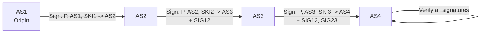

> [!NOTE] Definition
> BGPSec is a draft standard that extends [[Border Gateway Protocol|BGP]] with cryptographic path validation. Every AS hop in a BGP announcement must be signed, preventing attackers from forging or manipulating the AS_PATH attribute.

While [[Resource Public Key Infrastructure|RPKI]] only validates the **origin** AS of a route, BGPSec protects the **entire path**, closing the gap that allows subversion (MITM) attacks.

## How It Works

Each AS along the path creates a digital signature covering:
- The announced prefix
- Its own ASN and Subject Key Identifier (SKI)
- The **next hop AS** it is forwarding to

These signatures are stored in a `BGPSEC_Path` attribute and delivered together with the BGP announcement. Every receiving AS must verify all previous signatures in real time.

### Integration with RPKI

BGPSec builds on top of RPKI:
- A **ROA** binds the prefix to the origin AS (origin validation)
- **BGPSec signatures** ensure each hop in the path is legitimate (path validation)
- Forged origin announcements from non-authorized ASes will be invalid under both ROA and BGPSec

## Limitations

> [!WARNING]
> BGPSec faces significant adoption barriers.

- **High computational overhead**: routers must perform real-time cryptographic signature verification for every BGP announcement
- **Management complexity**: no single authority for prefix and certificate management across all ASes
- **RPKI dependency**: BGPSec requires RPKI to be fully deployed first, which is still in progress
- **Incremental adoption is impossible**: if a non-BGPSec AS appears on the path, all BGPSec signature information accumulated up to that point is lost. This means BGPSec only works when **all** ASes on a path support it.

## Related Concepts

- [[Border Gateway Protocol]]: the protocol BGPSec extends
- [[Resource Public Key Infrastructure]]: the PKI infrastructure BGPSec depends on
- [[BGP Hijacking]]: the attack class BGPSec aims to fully prevent
