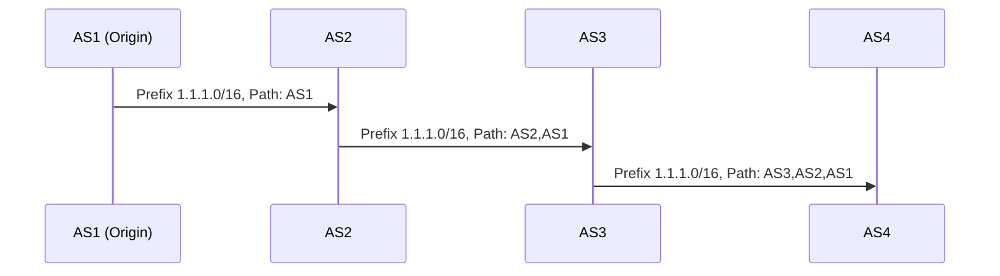

> [!NOTE] Definition
> The Border Gateway Protocol (BGP) is a path vector routing protocol used for exchanging routing and reachability information between [[Autonomous System|Autonomous Systems]] on the Internet.

BGP was designed in 1989 by Yakov Rekhter (IBM) and Kirk Lougheed (Cisco) during an IETF meeting. It is the protocol that enables the modern decentralized Internet to function.

## How It Works

BGP routers sit at the edges of ASes and exchange **BGP announcements** containing:
- **IP prefix**: the network being advertised (e.g., `1.1.1.0/16`)
- **AS_PATH**: the sequence of ASes the route has traversed

### Two Flavors of BGP

| Type | Scope | Purpose |
|------|-------|---------|
| **iBGP** (internal BGP) | Within a single AS | Distributes external routes internally |
| **eBGP** (external BGP) | Between different ASes | Exchanges routes across AS boundaries |

### BGP Announcement Propagation

When an AS originates a prefix, it announces it to its BGP neighbors. Each neighbor prepends its own ASN to the AS_PATH and selectively propagates the announcement further.

### Route Selection (Technical Logic)

When a router receives multiple routes to the same destination, it applies:

1. **Longest Prefix Match**: a more specific prefix (e.g., /24) is preferred over a less specific one (e.g., /16)
2. **Shortest AS Path**: among routes to the same prefix, the one with fewer AS hops wins

> [!IMPORTANT]
> Longest Prefix Match takes priority over Shortest Path. This is a key mechanism exploited in [[BGP Hijacking|sub-prefix hijacking attacks]].

### Security Weaknesses

BGP is fundamentally trust-based with no built-in security:
- No integrity protection for BGP messages
- No authenticity verification of announcements
- No validation of resource ownership claims
- No message freshness guarantees (vulnerable to replay attacks)

This means any AS can announce any prefix - whether it owns it or not.

## Related Concepts

- [[Autonomous System]]: the entities between which BGP operates
- [[Gao-Rexford Model]]: models the business logic behind route selection
- [[BGP Hijacking]]: attacks that exploit BGP's lack of authentication
- [[Resource Public Key Infrastructure]]: adds origin validation to BGP
- [[BGPSec]]: adds path validation to BGP
