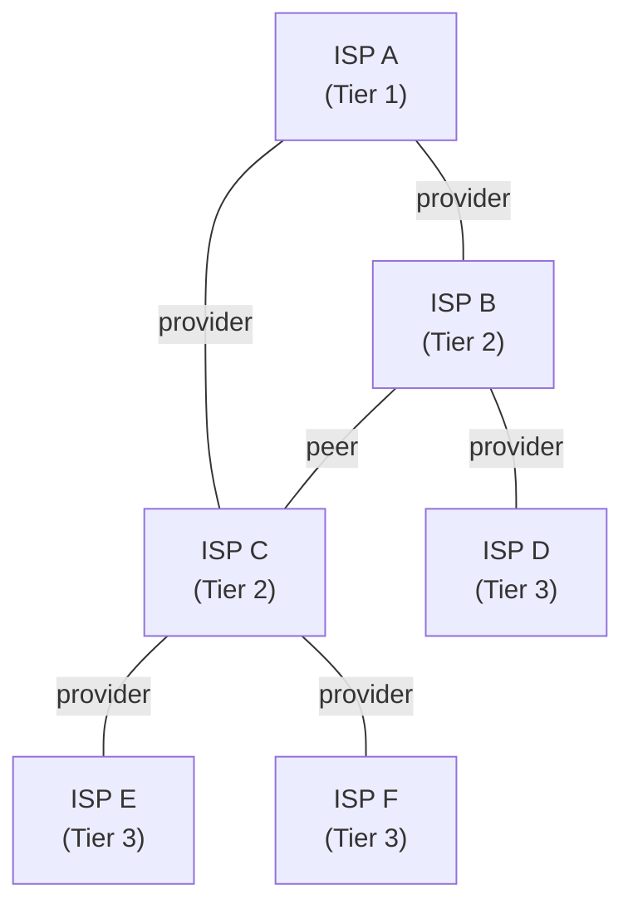

> [!NOTE] Definition
> The Gao-Rexford Model describes the business relationships between [[Autonomous System|Autonomous Systems]] and the routing policies that emerge from them, combining technical and economic considerations for BGP route selection.

Published by Lixin Gao and Jennifer Rexford in 2001, the model explains why BGP routing converges without global coordination.

## Business Relationships

The model classifies inter-domain connections into three types:

| Relationship | Description | Cash Flow |
|---|---|---|
| **Customer-to-Provider** | Customer pays provider for Internet access | Customer -> Provider |
| **Peer-to-Peer** | Peers exchange traffic freely for mutual benefit | No payment |
| **Provider-to-Customer** | Provider sells transit service to customer | Customer -> Provider |

## Export Policies (Route Propagation)

The business relationships dictate which routes an AS will share with its neighbors:

- **Customer routes**: shared with everyone (providers, peers, and other customers)
- **Peer routes**: shared **only** with customers
- **Provider routes**: shared **only** with customers

> [!IMPORTANT]
> The core rule: routes learned from peers or providers are never re-exported to other peers or providers. Only customer-learned routes (or own prefixes) are shared upward or sideways.

## Valley-Free Routing

A valid BGP path under the Gao-Rexford model will never go "down" to a customer and then back "up" to a provider, or sideways from a peer to another peer. This **valley-free** constraint ensures:

1. Low operational costs
2. Low latency
3. Increased routing efficiency

## Example

Consider AS4, a customer of AS3, which peers with AS2. Even though AS2 has a shorter path to AS0 (via AS1), AS4 cannot use it. AS2 learned the route from its provider AS1 and will not re-export provider-learned routes to its peer AS3. So AS4 must take the longer path: AS4 -> AS3 -> AS2 -> AS1 -> AS0.

## Related Concepts

- [[Border Gateway Protocol]]: the protocol whose behavior the model describes
- [[Autonomous System]]: the entities whose relationships are modeled
- [[BGP Hijacking]]: attacks that violate expected routing behavior
