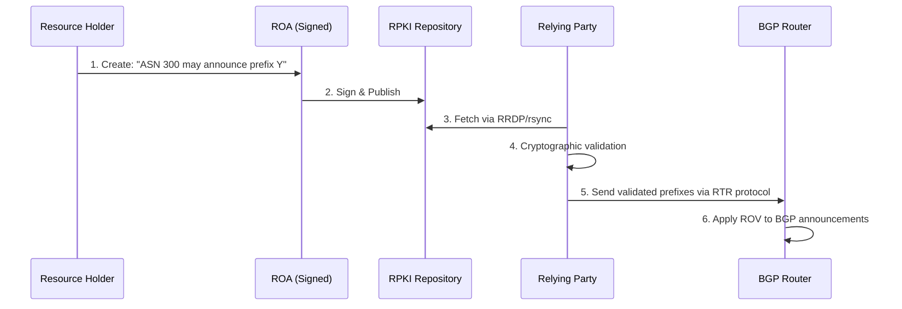
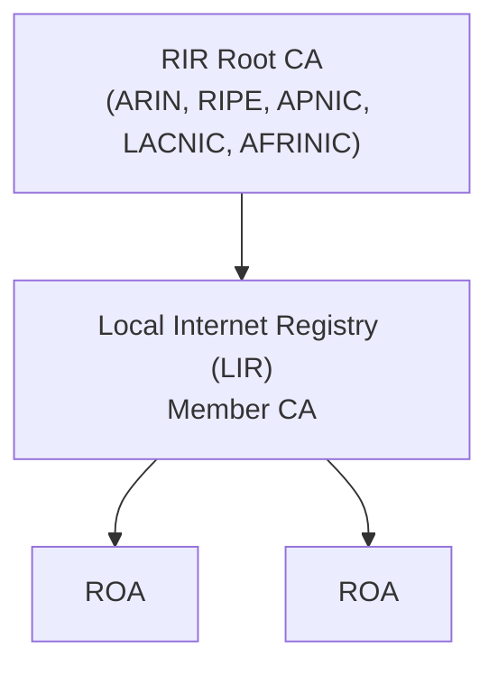

> [!NOTE] Definition
> Resource Public Key Infrastructure (RPKI) is a security framework that cryptographically binds network prefixes to their legitimate owner's [[Autonomous System|ASN]], enabling BGP routers to validate whether an AS is authorized to announce a given prefix.

RPKI was developed because [[Internet Routing Registry|IRR]] lacks authentication, allowing hijackers to impersonate legitimate resource holders.

## How It Works

### Core Components

1. **Route Origin Authorization (ROA)**: a cryptographically signed object issued by a prefix owner that specifies which ASN is authorized to originate specific IP prefixes. ROAs include:
   - Origin ASN
   - Authorized prefixes with maximum prefix length
   - Validity period

2. **Relying Party (RP)**: validator software that periodically downloads and cryptographically validates RPKI objects from Publication Points. It feeds validated data to BGP routers.

3. **Publication Points (PP)**: distributed servers that host and serve RPKI data (certificates and ROAs).

### RPKI Workflow

### Route Origin Validation (ROV)

ROV is the process by which BGP routers use RPKI data to evaluate incoming BGP announcements:

| Validation Result | Meaning | Routing Action |
|---|---|---|
| **Valid** | Origin ASN and prefix match a ROA | Route normally |
| **Invalid** | Origin ASN or prefix violates a ROA | Drop the route |
| **Not Found** | No ROA exists for this prefix | Route normally |

> [!IMPORTANT]
> "Not Found" routes are still accepted, which means prefixes without ROAs remain unprotected. This is why RPKI adoption must be widespread to be effective.

### Chain of Trust

RPKI uses a hierarchical PKI anchored at the five RIRs:

Each level signs the certificates of the level below using its private key, establishing a verifiable chain from RIR root down to individual ROAs.

### Communication Protocols

- **RRDP** (RPKI Repository Delta Protocol): HTTPS-based, primary protocol for fetching RPKI data
- **rsync**: backup protocol used when RRDP fails
- **RTR** (RPKI-to-Router): protocol that delivers validation results from RPs to BGP routers

## Deployment Status

RPKI adoption has grown significantly: approximately 62.8% of IPv4 prefix-origin pairs are RPKI-valid, with only about 1% marked as invalid.

## Limitations

- **Vulnerabilities**: RP software itself can be attacked (DoS, cache poisoning, path traversal). Over 62% of RPs are vulnerable to known attacks.
- **Misconfigurations**: operators use outdated software and patch slowly
- **Operational limits**: RPKI currently only validates route **origin**, not the full AS path. It can prevent redirection attacks but not subversion (MITM) attacks.
- **Downgrade attacks**: if RPKI infrastructure (DNS, PP servers) is DoS-ed, RPs go offline and routers fall back to unvalidated routing

> [!IMPORTANT]
> RPKI can be expanded with sub-protocols like [[BGPSec]] to also provide path protection alongside origin protection.

## Related Concepts

- [[Border Gateway Protocol]]: the protocol RPKI secures
- [[BGP Hijacking]]: the primary threat RPKI mitigates
- [[Internet Routing Registry]]: the non-cryptographic predecessor
- [[BGPSec]]: extends RPKI with AS path validation
- [[Autonomous System]]: the entities whose prefix ownership RPKI certifies
