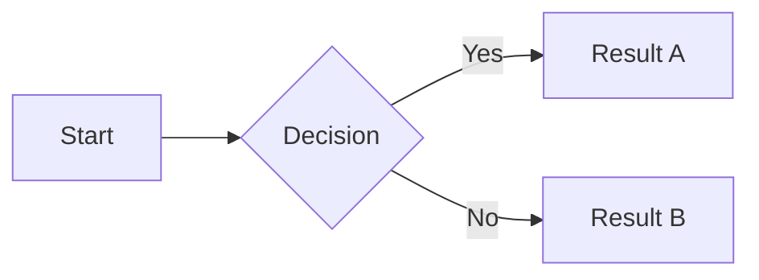
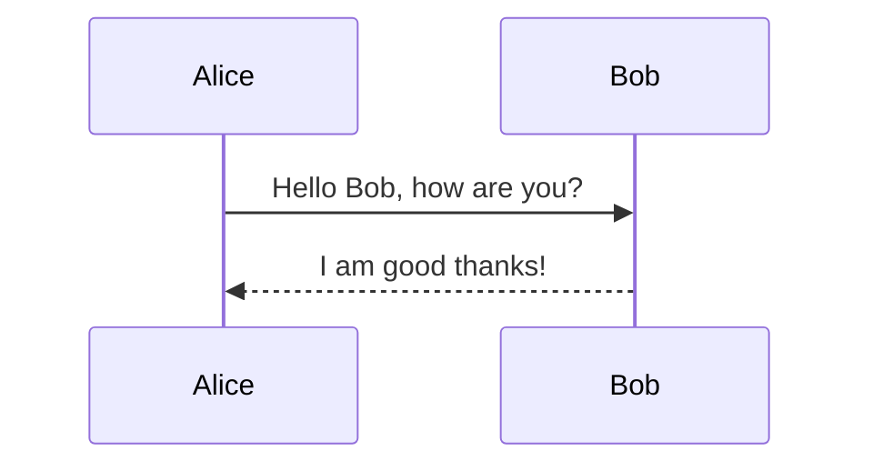
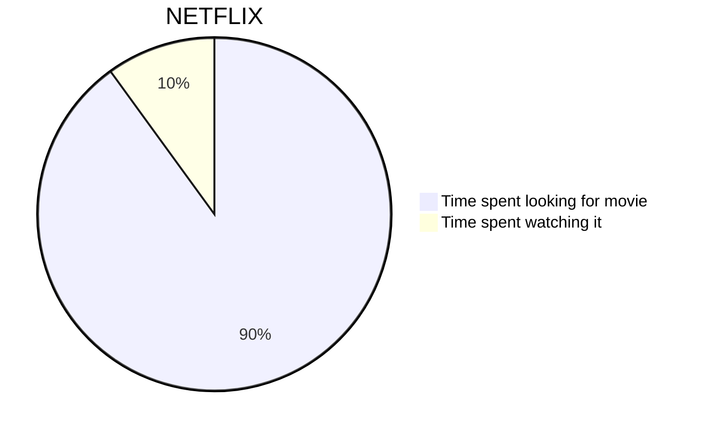
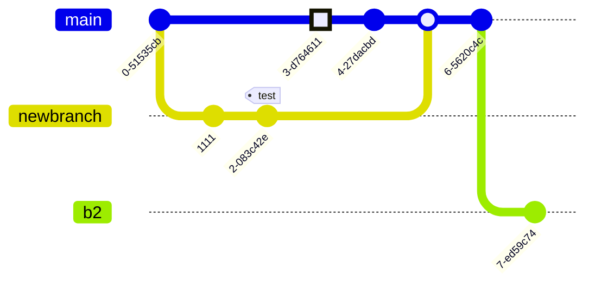

Main explanation goes here. Keep it focused on a single concept.

## Section

Content...

## Related Concepts

- [[Other Note]]: brief reason for the link

---
# Syntax
Full syntax docs: [https://quartz.jzhao.xyz/features/](https://quartz.jzhao.xyz/features/)

## Cool shit

### Comments
<!-- SYNTAX REFERENCE — delete everything below when using this template -->

---
### Callouts

> [!NOTE]
> Useful information that users should know, even when skimming content.

> [!IMPORTANT]
> Key information users need to know to achieve their goal.

> [!WARNING]
> Urgent info that needs immediate user attention to avoid problems.

---
### LaTeX

$$z = \sum_{i=1}^{n} w_i x_i + b = \mathbf{w}^\top \mathbf{x} + b$$

---
### Mermaid

