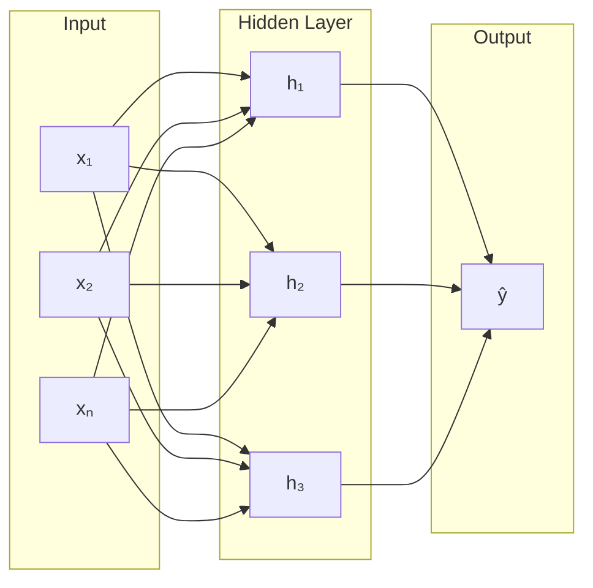

# Multilayer Perceptron

Ein **MLP** erweitert das [[Perzeptron]] um eine oder mehrere **Hidden Layers** und nichtlineare Aktivierungsfunktionen. Dadurch können auch nicht-linear separierbare Probleme (z. B. XOR) gelöst werden.

## Struktur

## Formel

**Forward Pass** durch Schicht $l$:

$$\mathbf{z}^{(l)} = \mathbf{W}^{(l)} \mathbf{a}^{(l-1)} + \mathbf{b}^{(l)}$$

$$\mathbf{a}^{(l)} = \sigma\!\left(\mathbf{z}^{(l)}\right)$$

- $\mathbf{W}^{(l)}$ — Gewichtsmatrix der Schicht $l$
- $\mathbf{b}^{(l)}$ — Bias-Vektor
- $\sigma$ — nichtlineare Aktivierungsfunktion (z. B. ReLU, Sigmoid)

## Training: Backpropagation

Der Gradient des Verlustes wird per **Kettenregel** rückwärts durch das Netz propagiert:

$$\frac{\partial \mathcal{L}}{\partial \mathbf{W}^{(l)}} = \frac{\partial \mathcal{L}}{\partial \mathbf{a}^{(l)}} \cdot \sigma'\!\left(\mathbf{z}^{(l)}\right) \cdot \mathbf{a}^{(l-1)\top}$$

Gewichts-Update via Gradient Descent:

$$\mathbf{W}^{(l)} \leftarrow \mathbf{W}^{(l)} - \eta \cdot \frac{\partial \mathcal{L}}{\partial \mathbf{W}^{(l)}}$$
