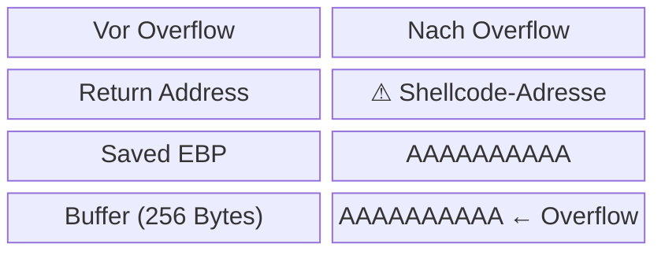
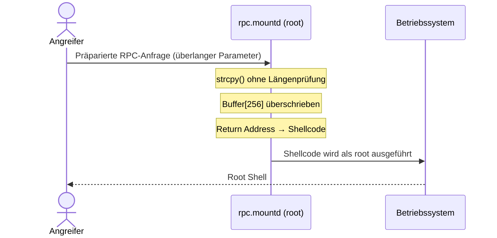

# NFS Buffer Overflow

**Network File System (NFS)** ist ein verteiltes Dateisystemprotokoll, das über **RPC (Remote Procedure Call)** kommuniziert. Historisch war NFS-Software mehrfach Ziel von **Buffer-Overflow-Angriffen**, da sie als privilegierter Daemon (root) läuft und Netzwerkeingaben verarbeitet.

## Angriffsprinzip

Ein Buffer Overflow entsteht, wenn Eingabedaten die Grenzen eines Puffers überschreiben und dabei benachbarte Speicherbereiche korrumpieren — insbesondere die **Rücksprungadresse** auf dem Stack.

## Konkretes Beispiel: rpc.mountd

Der Daemon **`rpc.mountd`** (verwaltet NFS-Mount-Anfragen) enthielt in älteren Implementierungen Schwachstellen durch unkontrollierte Nutzung von `strcpy()` / `sprintf()` ohne Längenprüfung.

**Angriffsablauf:**

## Gegenmaßnahmen

| Maßnahme | Wirkung |
|---|---|
| **ASLR** (Address Space Layout Randomization) | Speicheradressen werden randomisiert → Shellcode-Adresse nicht vorhersagbar |
| **Stack Canaries** | Zufälliger Wert zwischen Buffer und Rücksprungadresse → Overflow wird erkannt |
| **NX/DEP** (No-Execute Bit) | Stack-Speicher ist nicht ausführbar → Shellcode kann nicht direkt ausgeführt werden |
| **Safe APIs** (`strncpy`, `snprintf`) | Verhindert Overflows durch Längenbegrenzung |
| **Minimale Rechte** | Daemon nicht als root ausführen → Schaden begrenzen |

## Einordnung

Buffer Overflows in Netzwerkdiensten waren in den 1990ern und frühen 2000ern die häufigste Klasse von Remote-Exploits. NFS-Schwachstellen dieser Art (z. B. in SGI IRIX, Solaris) wurden aktiv in Worm-Propagation eingesetzt. Heute durch Compiler-Schutzmaßnahmen seltener — aber nicht ausgestorben (vgl. Heartbleed als verwandtes Konzept).
