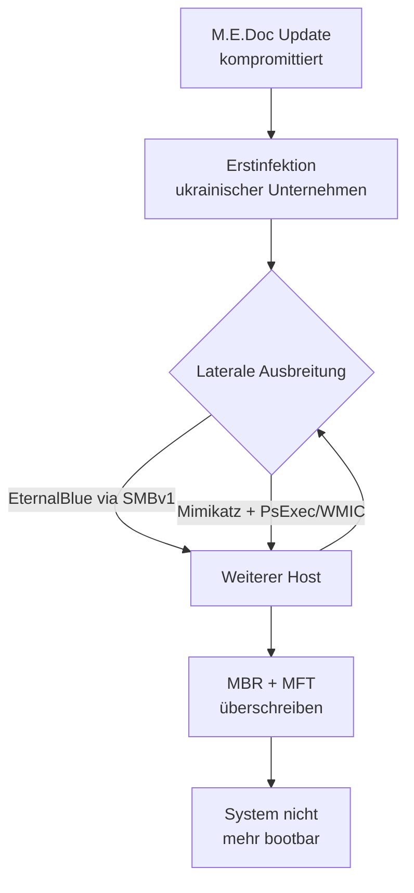

# NotPetya

**NotPetya** (Juni 2017) ist einer der destruktivsten Cyberangriffe der Geschichte. Er wurde zunächst für eine Variante der [[Ransomware]] *Petya* gehalten — tatsächlich war er jedoch ein **Wiper**: Verschlüsselter Inhalt konnte nie wiederhergestellt werden, da kein funktionierender Entschlüsselungsmechanismus existierte.

## Verbreitung

- Initiale Infektionsvektoren: kompromittiertes Update der ukrainischen Buchhaltungssoftware **M.E.Doc**
- Laterale Ausbreitung im Netzwerk über:
  - **EternalBlue** (NSA-Exploit für SMBv1, CVE-2017-0144) — dasselbe Tool wie bei [[WannaCry]]
  - **Mimikatz**-basiertes Credential-Harvesting → Ausführung über PsExec und WMIC

## Wirkung

- Überschreibt den **Master Boot Record (MBR)** → System nicht mehr bootbar
- Verschlüsselt zusätzlich die MFT (NTFS Master File Table)
- Ransom-Note war Ablenkung; keine echte Entschlüsselung möglich

## Schäden

| Organisation | Schaden |
|---|---|
| Maersk (Shipping) | ~$300 Mio., 45.000 PCs neu installiert |
| Merck (Pharma) | ~$870 Mio. |
| FedEx / TNT | ~$400 Mio. |
| Gesamtschaden (geschätzt) | **> $10 Mrd.** |

## Zuschreibung

Die USA, EU und mehrere Verbündete schrieben den Angriff dem russischen Militärgeheimdienst **GRU** (Einheit Sandworm) zu. Primärziel war die Ukraine, der Schaden breitete sich jedoch global aus (*Kollateralschaden durch Netzwerkvernetzung*).

## Lektionen

- Supply-Chain-Angriffe (kompromittiertes Software-Update) sind hocheffektiv
- Netzwerksegmentierung hätte die laterale Ausbreitung eingeschränkt
- Patch-Management (SMBv1 war bereits gepatcht durch MS17-010) ist kritisch
