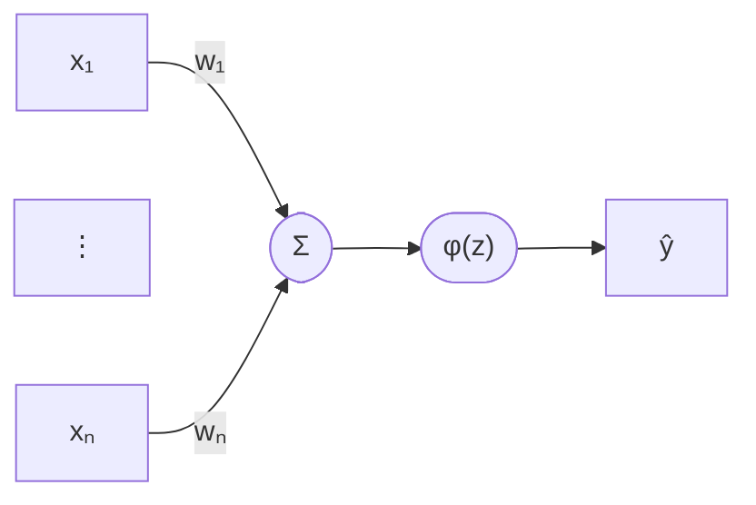

Das **Perzeptron** ist das einfachste Modell eines künstlichen Neurons und der Grundbaustein neuronaler Netze. Es berechnet eine gewichtete Summe seiner Eingaben und gibt über eine Aktivierungsfunktion eine binäre Entscheidung aus.

## Struktur

## Formel

Die gewichtete Summe (Net-Input):

$$z = \sum_{i=1}^{n} w_i x_i + b = \mathbf{w}^\top \mathbf{x} + b$$

Die Ausgabe der Aktivierungsfunktion:

$$\hat{y} = \varphi(z) = \begin{cases} 1 & \text{falls } z \geq 0 \\ 0 & \text{sonst} \end{cases}$$
