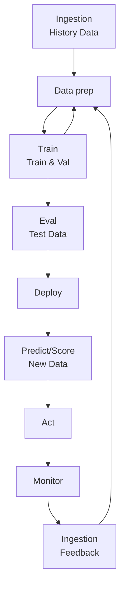

* Der Agent lernt indem er mit der Umgebung interagiert
* Der Agent bekommt eine numerische Belohnung, die er zu maximieren versucht
* Der Agent lernt indem er mit der Umgebung interagiert
* Der Agent bekommt eine numerische Belohnung, die er zu maximieren versucht
## Wann anwendbar?
* There is no supervisor but only a reward signal
* Feedback is always delayed; it is not instantaneous
* Time really matters, data is sequential, non iid
* Agent’s actions affect subsequent data it receives (Agent generates its own data)
