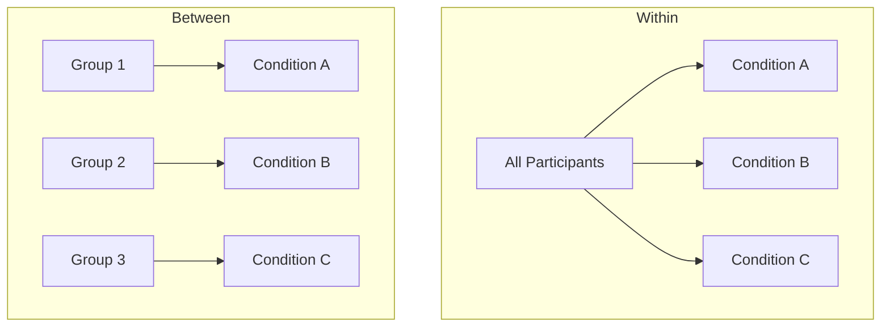

> [!NOTE] Definition
> In a within-subject design, every participant experiences all experimental conditions. In a between-subject design, each participant experiences only one condition, and different groups of participants are compared against each other.

## Within-Subject Design

Each participant is exposed to **all** conditions, so only one group of participants is needed for the entire experiment.

**Pros**: fewer participants needed for the same amount of data; smaller influence of interpersonal differences, since each participant acts as their own baseline.
**Cons**: susceptible to learning effects and carry-over effects - a participant may perform better on a later condition simply because they practiced on an earlier one.

## Between-Subject Design

Each participant is exposed to only **one** condition; the number of participant groups equals the number of experimental conditions.

**Pros**: simple design, low influence of fatigue or other time-based effects.
**Cons**: requires a much larger number of participants; results are more sensitive to interpersonal (individual) differences between groups.

## Countering Learning and Carry-Over Effects

Within-subject designs mitigate learning and carry-over effects primarily through [[Counterbalancing]] - varying the order in which conditions are presented across participants so that ordering effects cancel out across the sample rather than systematically favoring one condition.

## Choosing a Design

Prefer **within-subject** when participants are scarce or expensive to recruit, or when individual differences (e.g., skill level) would otherwise dominate the results. Prefer **between-subject** when conditions would cause strong carry-over (e.g., testing two versions of the same learning material) or when exposure to one condition would irreversibly change how a participant experiences the other.

## Related Concepts

- [[Controlled Experiment]]: the overall study format these designs fit into
- [[Counterbalancing]]: the primary technique for managing order effects in within-subject designs
- [[Validity and Reliability]]: design choice affects both internal validity (carry-over) and how many participants are needed for reliable results
