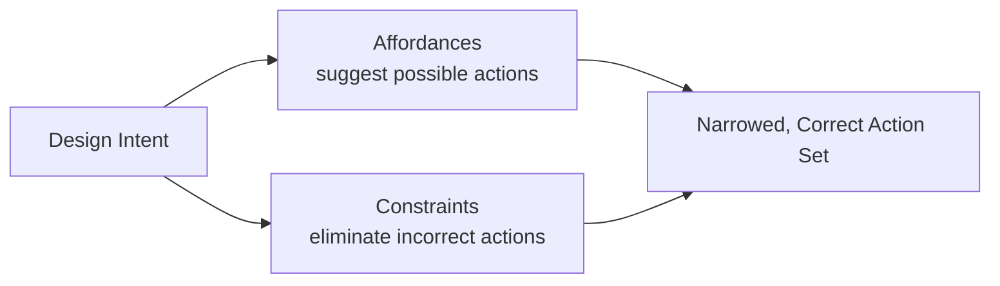

> [!NOTE] Definition
> A constraint restricts the set of possible actions a user can take with an object or interface, narrowing choices toward correct behavior and preventing errors. Donald Norman (1988) identified four types of constraints.

## The Four Types

| Type | Description | Example |
|---|---|---|
| **Physical** | The physical shape or structure makes only certain actions possible | A SIM card tray only fits in one orientation |
| **Cultural** | Widely shared conventions dictate expected behavior | Red generally signals "stop" or "danger" across cultures |
| **Logical** | The layout or arrangement implies a reasonable interpretation | If four burner knobs map spatially to four burners, the mapping is deducible without labels |
| **Semantic** | The meaning of a situation limits sensible actions | A helmet's shape and purpose imply it goes on a head, not a foot |

## Why Constraints Matter

Constraints work together with [[Affordances]] to guide behavior: an affordance suggests *what can be done*, while a constraint limits *what should be done* or restricts incorrect actions from being possible at all.

## Design Application

- **Preventing slips**: physical constraints (a notch, a keyed connector) make it impossible to plug something in the wrong way
- **Preventing mistakes**: logical and semantic constraints help users correctly interpret unfamiliar controls without instructions
- **Cultural constraints require localization**: a color or icon convention in one culture may not transfer to another

## Example

A USB-C connector is symmetric so that no orientation is "wrong" - a physical constraint solved by removing the constraint entirely. A car's automatic transmission requiring the brake pedal to be pressed before shifting out of Park is a logical/semantic constraint preventing an unsafe action.

## Related Concepts

- [[Affordances]]: constraints and affordances jointly shape which actions users attempt
- [[Human Error in HCI]]: well-designed constraints prevent slips before they can occur
- [[Metaphors in HCI]]: cultural constraints often underlie which metaphors will be understood
