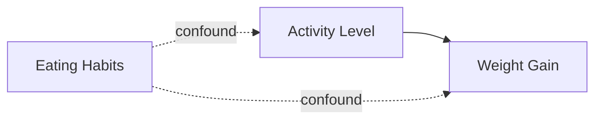

> [!NOTE] Definition
> Beyond the [[Independent and Dependent Variables|independent and dependent variable]], every experiment has other variables that are either deliberately controlled, deliberately allowed to vary randomly, or unintentionally correlated with the outcome as a confound.

## Control Variables

What is held **constant** across all trials and participants so it cannot explain any observed difference.

**Example**: lighting conditions, room temperature, hardware used by every participant.

## Random Variables

What is deliberately **allowed to vary randomly** between trials or participants, because holding it constant is impractical or would itself distort results. A random variable should have an expected relationship to the independent variable that averages out over enough trials.

**Example**: time of day a session takes place.

## Confounding Variables

An extra variable that was **not accounted for** and correlates with both the independent and dependent variable, creating the illusion of a causal relationship (or hiding a real one) that the study did not actually test.

**Example**: a study finds that people with higher physical activity level (IV) gain more weight (DV) - if starting weight, eating habits, age, or occupation were not controlled, one of those could be the true driver of the correlation rather than activity level itself.

## Mitigating Confounds

- **Random sampling** with a sufficiently large sample so confounding factors average out across groups
- **Explicitly controlling** for a suspected confound (e.g., restricting the sample to a fixed age range)

## Related Concepts

- [[Independent and Dependent Variables]]: the primary variables these extra variable types are defined in relation to
- [[Controlled Experiment]]: the study format where distinguishing these variable types matters most
- [[Validity and Reliability]]: uncontrolled confounds threaten a study's internal validity
