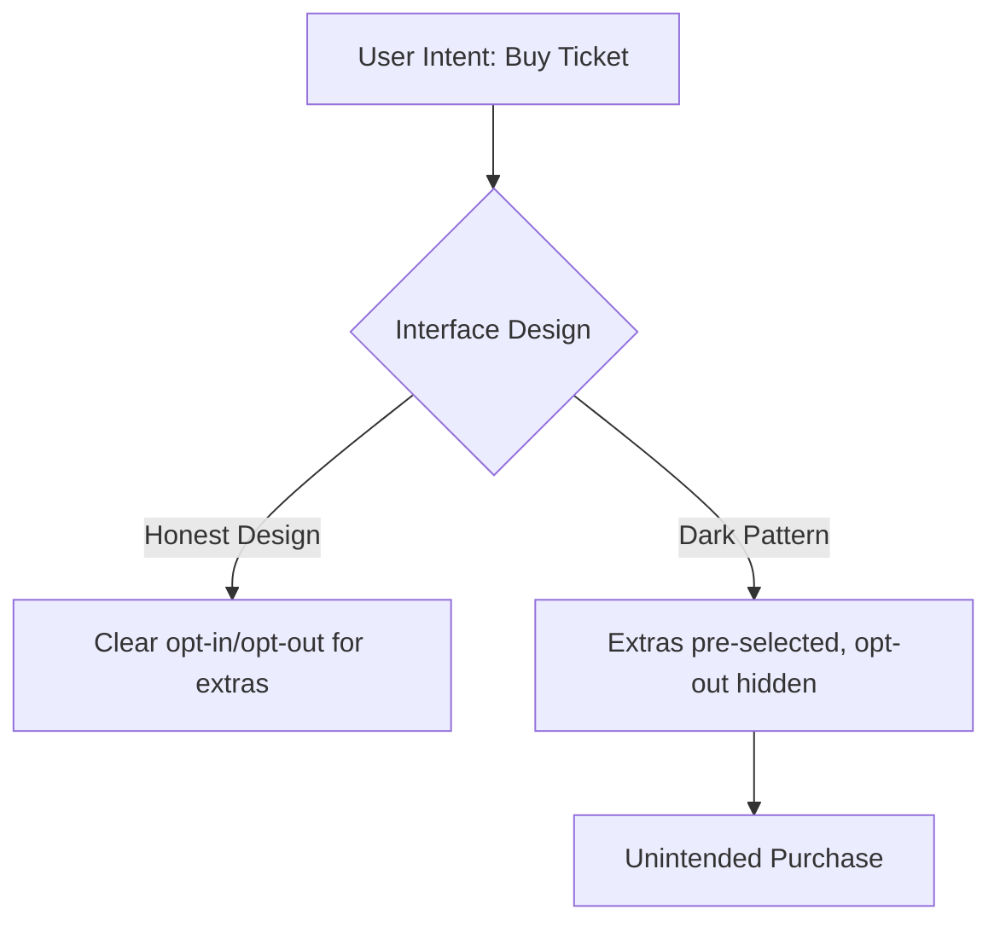

> [!WARNING] Definition
> Dark Patterns (also called Deceptive Design) are user interface design choices that intentionally manipulate or trick users into actions benefiting the business rather than the user - for example, unintended purchases or oversharing of data.

## Categories

| Pattern | Description | Example |
|---|---|---|
| **Nagging** | Redirection of expected functionality that persists across one or more interactions | Repeated pop-ups asking to enable notifications after being dismissed |
| **Obstruction** | Making a process more difficult than necessary to dissuade an action | Burying the "cancel subscription" option behind multiple confirmation screens |
| **Sneaking** | Hiding, disguising, or delaying disclosure of information relevant to the user | Adding an extra item (e.g., insurance) to a shopping cart by default |
| **Interface Interference** | Manipulating the interface to visually privilege certain actions over others | A highlighted "Accept All" cookie button next to a barely visible "Reject" link |
| **Forced Action** | Requiring the user to perform an unrelated action to complete their intended task | Forcing account creation before allowing a simple purchase to complete |

## Example: Ryanair Insurance Dropdown

A well-known example is an airline booking flow where travel insurance is pre-selected via a dropdown list of countries, with "I do not want insurance" placed alphabetically among a long list of country names - combining **Sneaking** (the option is not obviously an opt-out) with **Interface Interference** (the real choice is visually camouflaged).

> [!IMPORTANT]
> Dark patterns exploit the same cognitive shortcuts - [[Gestalt Principles]], habitual [[Human Error in HCI|slips]], and limited [[Cognitive Load Theory|cognitive load]] - that good design normally uses to help users, but redirect them against the user's own interest.

## Related Concepts

- [[Gestalt Principles]]: visual grouping and emphasis techniques exploited by Interface Interference
- [[Human Error in HCI]]: dark patterns often engineer slips and mistakes deliberately
- [[Gulf of Execution and Evaluation]]: Obstruction patterns deliberately widen the Gulf of Execution
- [[Mental Models]]: Sneaking exploits user assumptions about default, safe behavior
