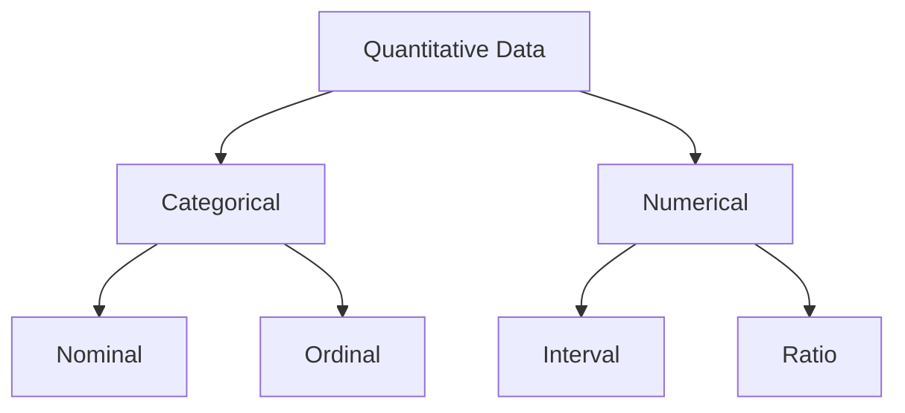

> [!NOTE] Definition
> Quantitative data can be categorical (representing characteristics) or numerical (representing a measurable quantity), and is further classified into four measurement scales - nominal, ordinal, interval, and ratio - which determine which mathematical operations are meaningful on it.

## The Hierarchy

## Categorical Data

Represents characteristics rather than measurable quantities. Even when expressed as numbers, categorical data has no inherent mathematical meaning - the distance between categories is not necessarily equal or meaningful.

| Scale | Property | Example |
|---|---|---|
| **Nominal** | No natural order | Country, language, gender |
| **Ordinal** | Natural order, but unequal/undefined spacing | Grades (1 = very good ... 5 = fail), coffee sizes (small/medium/large) |

For ordinal data, a "1" grade is not necessarily "twice as good" as a "2" - the numeric labels only encode order, not magnitude.

## Numerical Data

Represents a genuine measurable quantity where the same numeric difference means the same thing everywhere on the scale, and standard arithmetic (addition, multiplication) is mathematically valid.

| Scale | True Zero? | Ratio Meaningful? | Example |
|---|---|---|---|
| **Interval** | No | No | Temperature in Celsius - 40°C is not twice as hot as 20°C |
| **Ratio** | Yes | Yes | Weight in kg - 10kg is twice as heavy as 5kg |

> [!IMPORTANT]
> The same underlying quantity can be interval or ratio depending on the **scale** used: Celsius has no true zero (interval), while Kelvin's zero represents the total absence of thermal energy (ratio) - so 300K genuinely has twice the thermal energy of 150K, but 40°C is not twice as hot as 20°C.

## Why This Matters for Analysis

The data type determines which statistical tests are valid - see [[Statistical Significance Testing]]. Nominal and ordinal data typically require non-parametric tests, while interval and ratio data support parametric tests such as the [[T-Test]] or [[ANOVA]], provided their other assumptions are also met.

## Related Concepts

- [[Independent and Dependent Variables]]: the dependent variable's measurement scale determines which statistics are valid
- [[Statistical Significance Testing]]: test choice depends on the data type being analyzed
- [[Descriptive Statistics]]: some descriptive measures (e.g., mean) are only meaningful above the ordinal level
