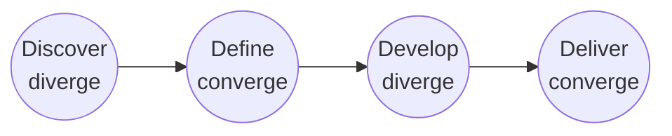

> [!NOTE] Definition
> Design process methodologies differ in how explicitly they separate divergent (idea-generating) and convergent (decision-making) phases, and in whether they are structured as a single linear pass or a repeating cycle.

## The Double Diamond

The Double Diamond model (popularized by the UK Design Council) visualizes the design process as two consecutive diamonds, each alternating between divergent and convergent thinking:

| Phase | Type | Activity |
|---|---|---|
| **Discover** | Diverge | Explore the problem broadly, gather insights |
| **Define** | Converge | Narrow down to a specific, well-defined problem statement |
| **Develop** | Diverge | Generate and prototype a wide range of solutions |
| **Deliver** | Converge | Test, refine, and finalize a single solution for release |

## Bobbe et al. (2016) - Linear Stage Model

An alternative, more linear framing structures the process into four sequential stages: **analyse**, **define**, **design**, and **finalise**. Unlike the cyclic [[Human-Centered Design Process]], this model treats the stages as largely sequential checkpoints rather than a repeating loop, making it easier to plan project timelines but less naturally suited to rapid iteration based on user feedback.

## Comparing the Models

| Model | Structure | Emphasis |
|---|---|---|
| [[Human-Centered Design Process]] (ISO 9241-210) | Repeating 4-stage cycle | Continuous validation against user needs |
| **Double Diamond** | Two diverge/converge diamonds | Explicit separation of problem-space and solution-space exploration |
| **Bobbe et al. linear stages** | Sequential analyse/define/design/finalise | Planning and project management clarity |

All three models agree that design should not jump straight from problem to final solution - some structured exploration (divergence) must precede narrowing (convergence) - but they differ in how much iteration and cycling back they build in.

## Related Concepts

- [[Human-Centered Design Process]]: the cyclic ISO standard process this model family is often compared against
- [[Design Thinking]]: a related but distinct human-centered methodology emphasizing empathy and reframing
- [[Ideation Methods in HCI]]: used during divergent phases of any of these models
