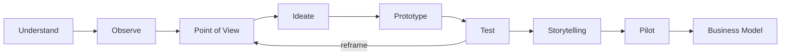

> [!NOTE] Definition
> Design Thinking is a methodology for tackling "wicked problems" - ill-defined, complex problems without a clear correct answer - by deeply empathizing with users, reframing the problem, and iterating quickly between ideation, prototyping, and testing.

## Wicked Problems

Horst Rittel coined the term **wicked problem** to describe problems that cannot be solved with a single, straightforward engineering approach: the problem definition itself is unstable, there is no stopping rule, and every attempted solution changes the understanding of the problem. Most real design challenges (not just puzzles with a known-correct answer) are wicked problems, which is why Design Thinking treats problem framing as an ongoing activity rather than a fixed input.

## The Stages

| Stage | Activity |
|---|---|
| **Understand** | Build background knowledge on the problem domain |
| **Observe** | Conduct field research and ethnographic study of real users |
| **Point of View (POV)** | Reframe the problem based on what was learned, often as a specific user need statement |
| **Ideate** | Generate a wide range of possible solutions (see [[Ideation Methods in HCI]]) |
| **Prototype** | Build tangible representations of ideas (see [[Prototyping in HCI]]) |
| **Test** | Validate prototypes with users, feeding insights back into reframing the POV |
| **Storytelling** | Communicate the solution and its rationale to stakeholders |
| **Pilot** | Deploy the solution at small scale before full rollout |
| **Business Model** | Ensure the solution is viable beyond the design itself |

## Empathy and Reframing

The core mechanism that distinguishes Design Thinking from a purely linear engineering process is the deliberate cycle of building **empathy** with users during Understand/Observe, then using that empathy to **reframe** the problem statement (POV) - often the initially stated problem is not the real problem, and reframing is what unlocks non-obvious solutions.

## Related Concepts

- [[Human-Centered Design Process]]: Design Thinking is a concrete methodology that operationalizes human-centered design principles
- [[Ideation Methods in HCI]]: the toolset used during the Ideate stage
- [[Design Process Methodology Comparison]]: contrasts Design Thinking with other structured design processes like the Double Diamond
- [[Ethnography in HCI]]: the primary technique used during the Observe stage
