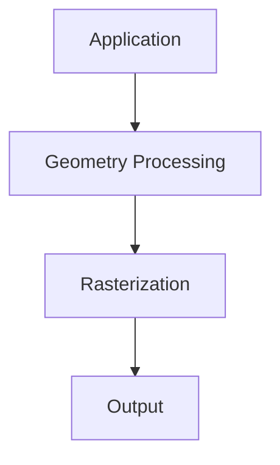

> [!NOTE] Definition
> The graphics pipeline is a sequence of processing stages that transforms 3D scene descriptions into 2D rendered images on screen.

## Computer Graphics vs. Computer Vision

| Field | Direction |
|-------|-----------|
| **Computer Graphics** | Real scene $\rightarrow$ digital representation |
| **Computer Vision** | Digital image $\rightarrow$ interpretation of real scene |

## Pipeline Stages

| Stage | Operations |
|-------|-----------|
| **Application** | Input data, [[3D Data Representation]] |
| **Geometry Processing** | Clipping, culling, transformation, lighting simulation |
| **Rasterization** | Visibility computation, color interpolation |
| **Output** | Storage, display, hardcopy |

### Geometry Processing Sub-steps

- **Model transformation**: scale and rotate individual models
- **View transformation**: position all models relative to the camera
- **Projection transformation**: perspective or parallel projection of the scene

## Hardware Architecture

## Hardware Paradigms

1. Large-Scale Computing
2. Personal Computing
3. Networked Computing
4. Mobile Computing
5. Collaborative Computing
6. Virtual Reality & Augmented Reality (immersive / non-immersive)

## Related Concepts

- [[Shading Models]]: lighting computation within the pipeline
- [[Rasterization Algorithms]]: converting geometry to pixels
- [[Affine Transformation]]: transformations applied in the geometry stage
- [[Spatial Data Structures in Computer Graphics]]: acceleration structures for culling
