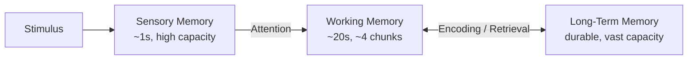

> [!NOTE] Definition
> Human memory is commonly modeled as three interacting stores - sensory memory, working memory, and long-term memory - each with distinct capacity, duration, and role in processing information.

## The Three Stores

| Store | Duration | Capacity | Role |
|---|---|---|---|
| **Sensory memory** | Under 1 second | High, but unfiltered | Brief buffer holding raw perceptual impressions before attention selects what to process further |
| **Working memory** | ~20 seconds without rehearsal | ~4±1 chunks | Active reasoning, holding information currently being used |
| **Long-term memory** | Durable (years) | Effectively unlimited | Stores learned knowledge, skills, and experiences for later retrieval |

## Why This Matters in HCI

- **Sensory memory** explains why brief visual feedback (e.g., a button flash) can register even if the user isn't consciously attending to it
- **Working memory** limits are the basis of [[Cognitive Load Theory]] - interfaces that require holding too much information at once (unlabeled multi-step forms, deep menu paths without breadcrumbs) exceed this capacity
- **Long-term memory** is what interfaces rely on when they use familiar [[Metaphors in HCI|metaphors]] and consistent patterns - recognition against long-term memory is faster and less error-prone than reasoning from scratch

## Example

A multi-digit confirmation code shown briefly on screen and then hidden relies on working memory to bridge the gap until the user types it elsewhere - if the code exceeds roughly 4-7 chunks or the gap is too long, recall fails and the user must look it up again.

> [!IMPORTANT]
> Design implication: prefer **recognition over recall**. Menus and visible options draw on long-term memory recognition, which is far more reliable than requiring users to recall commands or paths from working or long-term memory unaided.

## Related Concepts

- [[Cognitive Load Theory]]: directly builds on working memory capacity limits
- [[Model Human Processor]]: formalizes these memory stores alongside processing cycle times
- [[Mental Models]]: mental models are stored and retrieved from long-term memory
