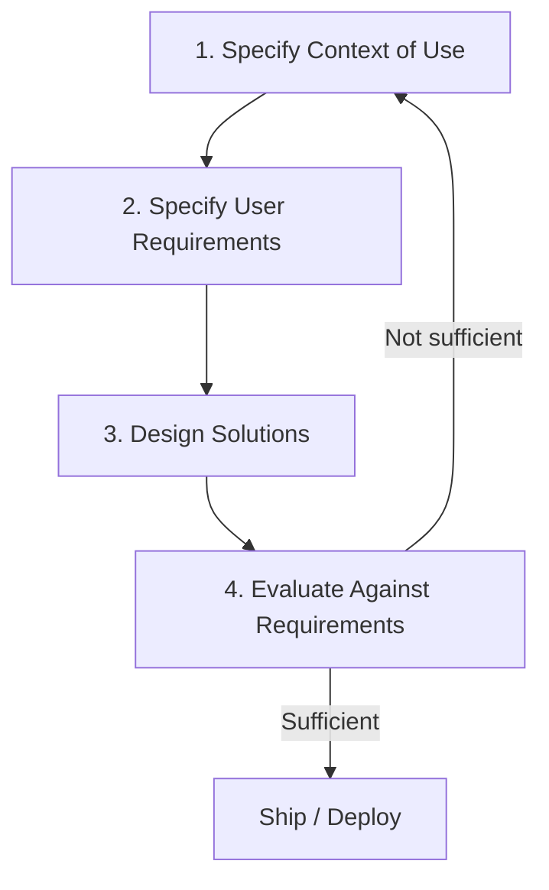

> [!NOTE] Definition
> Human-Centered Design (HCD), formalized in ISO 9241-210, is an iterative design process in which the needs, limitations, and context of end users guide every stage of development, evaluated and refined in repeated cycles rather than a single linear pass.

## The Four-Stage Cycle

| Stage | Activity |
|---|---|
| **1. Specify context of use** | Identify who the users are, what tasks they perform, and in what environment |
| **2. Specify user requirements** | Translate context understanding into explicit, testable requirements |
| **3. Design solutions** | Produce prototypes ranging from low-fidelity sketches to functional mockups |
| **4. Evaluate against requirements** | Test designs with real users; if requirements are unmet, cycle back |

The process is explicitly **iterative**: evaluation results feed back into context and requirements understanding, not just design refinement, since testing often reveals that the original requirements were incomplete or wrong.

## Research Methods Feeding the Process

Understanding "context of use" and "user requirements" draws on both:

- **Qualitative methods** (see [[Qualitative vs Quantitative Research Methods]]) such as [[Ethnography in HCI|ethnography]] and [[Interview Techniques in HCI|interviews]], which uncover *why* users behave as they do
- **Quantitative methods**, such as surveys and usage metrics, which measure *how much/how often*

> [!IMPORTANT]
> HCD differs from waterfall-style design in that it treats requirements as provisional until validated by evaluation with real users - the cycle can and should repeat multiple times before release.

## Criticism of Human-Centered Design

Don Norman, one of the field's foundational figures, has argued that human-centered design has a **lack of innovation** problem: by strictly grounding every design decision in what current users say they want or can articulate, HCD tends to produce incremental improvements to existing solutions rather than radical, category-defining innovations. Users generally cannot imagine or ask for a solution that does not yet exist, so a process anchored entirely in stated user needs can systematically miss disruptive ideas.

> [!WARNING]
> This is not an argument against understanding users, but a caution that HCD should be paired with genuine ideation and technology-driven exploration (see [[Ideation Methods in HCI]]) rather than treated as a purely user-request-driven checklist.

## Related Concepts

- [[User-Centered Design]]: a closely related methodology emphasizing early and continuous user focus
- [[Ethnography in HCI]]: a key method for the "specify context of use" stage
- [[Interview Techniques in HCI]]: a key method for gathering user requirements
- [[Qualitative vs Quantitative Research Methods]]: the two complementary research approaches used throughout the cycle
- [[Design Thinking]]: an alternative methodology that explicitly builds in reframing to counter incrementalism
