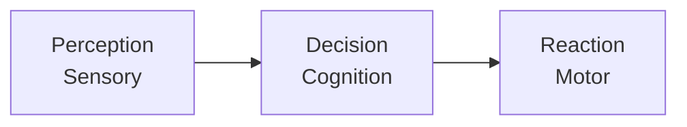

> [!NOTE] Definition
> The Human-Machine Interface describes the channels through which humans perceive, process, and respond to information from machines.

## Sensory Interfaces

Humans interact with machines through five sensory channels:
- **Visual** - seeing
- **Auditory** - hearing
- **Haptic** - touching
- **Olfactory** - smelling
- **Gustatory** - tasting

> [!IMPORTANT]
> Perception and reality can differ significantly. **Cognition** is the process of interpreting input and deciding on output.

## Three-Stage Model

The three subsystems:

| Stage | Function | Subtypes |
|-------|----------|----------|
| Perception | Receiving stimuli | Visual, auditory, haptic, olfactory, gustatory |
| Decision | Processing and choosing | Cognitive evaluation |
| Reaction | Executing response | Vocal, motor |

## Related Concepts

- [[Human Visual System]]: the visual perception channel in detail
- [[Visual Attention]]: how attention is allocated during perception
- [[User-Centered Design]]: designing interfaces around human capabilities
