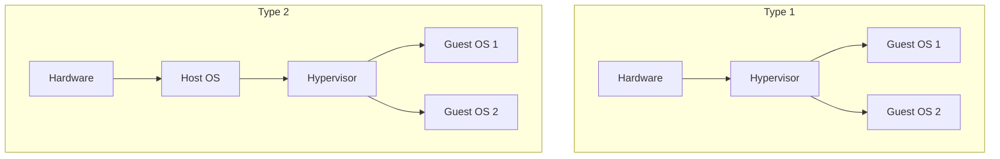

> [!NOTE] Definition
> A hypervisor (Virtual Machine Monitor) enables multiple operating systems to run simultaneously on the same physical hardware.

## Types

### Type 1 - Bare Metal
- Runs directly on hardware, no host OS
- Guest OSes run on top of the hypervisor
- Better performance and security
- Examples: VMware ESXi, Xen, Microsoft Hyper-V

### Type 2 - Hosted
- Runs as an application on top of a host OS
- Easier to set up, but additional overhead from the host OS layer
- Examples: VirtualBox, VMware Workstation

## Use Cases

- Server consolidation
- Isolation between workloads
- Testing and development environments
- Cloud computing infrastructure

## Related Concepts

- [[User Mode und Kernel Mode]]: virtualization adds another privilege layer
- [[x86 Schutzringe]]: modern CPUs have hardware virtualization extensions
