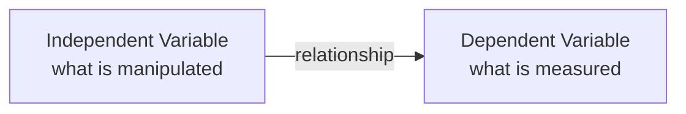

> [!NOTE] Definition
> The independent variable (IV) is what the researcher manipulates or changes in an experiment; the dependent variable (DV) is what is measured to observe the effect of that manipulation.

## Independent Variable (IV)

The IV represents the possible **cause** of a change - the factor the researcher controls and varies across conditions. Every IV has a name and a set of **levels** (its possible values), analogous to a variable declaration in a programming language: `var name = a | b | c | ...`.

**Examples**: type of interaction technique, input modality, context of use.

## Dependent Variable (DV)

The DV represents the **effect** or outcome the researcher is interested in measuring - what changes (or doesn't) as a result of the IV.

**Examples**: task completion time and speed (efficiency), error rate (accuracy), subjective satisfaction, ease of learning and retention rate, physical or cognitive demand.

## Example

Research question: *"Which input device allows users to perform best in competitive third-person games?"*

- **IV**: input device, with levels *mouse*, *touch*, *controller*
- **DV**: in-game score after playing for a fixed duration

## Related Concepts

- [[Controlled Experiment]]: the study format in which IVs and DVs are formally defined and tested
- [[Control, Random, and Confounding Variables]]: the other variable types that must be managed alongside IV and DV
- [[Research Question and Hypothesis Formulation]]: a well-formed hypothesis explicitly names both the IV and DV
- [[Data Types in Quantitative Research]]: DVs are measured using one of these data types
