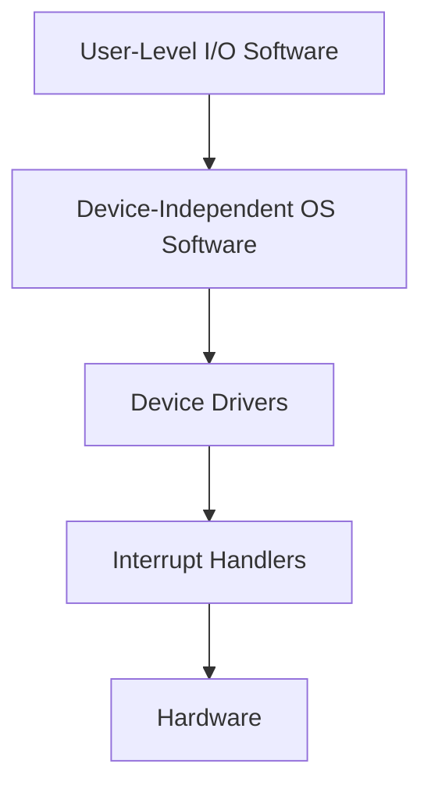

> [!NOTE] Definition
> Interrupt handling is a multi-step process that saves the current state, processes the interrupt, and resumes execution.

## Steps

1. Save registers
2. Prepare context for the interrupt service procedure
3. Set up the stack for the interrupt service procedure
4. Acknowledge the interrupt controller
5. Copy registers to the process table
6. Execute the interrupt service procedure
7. Select the next process to run (scheduling decision)
8. Set up MMU context for the next process
9. Load registers of the new process
10. Start the new process

## I/O Software Layers

The OS organizes I/O handling in layers:

## Device-Independent I/O Software

Provides a uniform interface regardless of the specific device:
- Standardized driver interface
- Buffering
- Error reporting
- Device allocation and deallocation
- Device-independent block sizes

## Related Concepts

- [[Interrupts]]: what triggers this handling process
- [[Precise vs Imprecise Interrupts]]: affects how state is saved
- [[Device Drivers]]: the device-specific code invoked during handling
