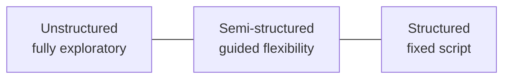

> [!NOTE] Definition
> User interviews are a qualitative research method for eliciting needs, attitudes, and experiences directly from users through conversation, ranging from tightly scripted to fully open-ended formats.

## The Three Formats

| Format | Structure | Best For |
|---|---|---|
| **Structured** | Fixed, predetermined questions asked in the same order to every participant | Comparable data across many participants, hypothesis testing |
| **Semi-structured** | A prepared question guide, but the interviewer can probe and follow up freely | Balancing comparability with the flexibility to explore unexpected topics |
| **Unstructured** | No fixed question set, conversational and exploratory | Early-stage, open-ended discovery when the researcher does not yet know what to ask |

## Choosing a Format

- Use **unstructured** interviews early in a project, when requirements are unclear and the goal is discovering the problem space
- Use **semi-structured** interviews once themes are known but individual variation and follow-up matter
- Use **structured** interviews when comparing responses systematically across a larger set of participants, closer to a verbal survey

## Pitfalls

- Users often report idealized or rationalized behavior rather than actual behavior (self-report bias) - pairing interviews with [[Ethnography in HCI]] mitigates this
- Leading questions can bias responses; questions should be neutral and open-ended
- Small sample sizes (typical for qualitative interviews) limit statistical generalization

## Pros and Cons by Format

| Format | Pro | Con |
|---|---|---|
| **Structured** | Large amounts of quantitative data collected cheaply, ready for statistical analysis | Lacks detail and cannot capture unexpected responses |
| **Unstructured** | Flexible, can include concepts discovered mid-interview; allows deeper follow-up ("why", "why not") | Time-consuming and difficult to analyze (e.g., grounded theory, thematic analysis) |

## The Interviewer Effect

Since the interviewer is also a human participating in the interaction, their appearance and behavior can influence the participant's responses. If participants sense the study's intention or goal, they may answer to please the interviewer rather than honestly.

**Example:** In a study exploring sexual harassment between men, a female interviewer could bias the sample if participants feel uncomfortable or misrepresent their experiences as a result.

**Mitigations:**
- Choose an interviewer perceived as neutral as possible
- Train interviewers to remain objective and unbiased
- Avoid disclosing the proposed solution when a comparison is being tested

## Related Concepts

- [[Ethnography in HCI]]: often combined with interviews via contextual inquiry
- [[Focus Groups]]: the group counterpart to individual interviews
- [[Qualitative vs Quantitative Research Methods]]: interviews are a core qualitative method
- [[Human-Centered Design Process]]: interviews inform the "specify user requirements" stage
