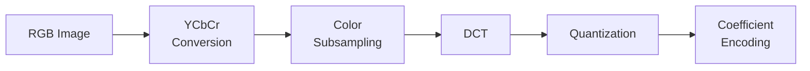

> [!NOTE] Definition
> JPEG is the most widely used lossy image compression standard. It exploits properties of human vision to discard imperceptible information while maintaining visual quality.

## Compression Pipeline

### Step-by-Step

1. **Color space conversion**: Convert from RGB to $YC_RC_B$ (separating luminance from chrominance)
2. **Color subsampling**: Small regions get a uniform color value but retain precise brightness values (because human vision is more sensitive to luminance than chrominance)
3. **Discrete Cosine Transform (DCT)**: Decompose image blocks into frequency components
4. **Quantization**: Remove information deemed unimportant (this is the lossy step)
5. **Coefficient encoding**: Generate the final bitstream

> [!IMPORTANT]
> The quantization step is where information is irreversibly lost. Higher quantization = smaller file but more artifacts (blocking, ringing).

## Related Concepts

- [[Image Compression]]: overview of lossless and lossy compression
- [[Fourier Transform]]: DCT is closely related to the Fourier Transform
- [[Human Visual System]]: JPEG exploits the eye's lower sensitivity to chrominance
