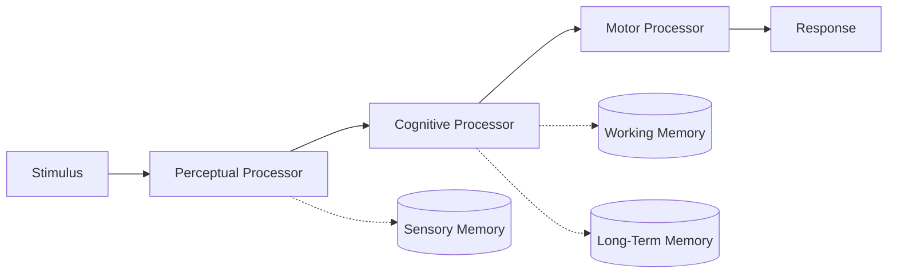

> [!NOTE] Definition
> The Model Human Processor (MHP), proposed by Card, Moran, and Newell (1983), models human information processing as three interacting subsystems - perceptual, cognitive, and motor - each with associated memories and processing cycle times, enabling quantitative prediction of task performance.

## The Three Processors

| Processor | Function | Approx. Cycle Time |
|---|---|---|
| **Perceptual** | Encodes sensory stimuli into internal representations | ~100 ms |
| **Cognitive** | Reasons over representations, retrieves memory, decides on action | ~70 ms |
| **Motor** | Executes physical responses | ~70 ms |

These cycle times let researchers predict how long a user takes to notice, decide, and react to a stimulus - the basis for later analytic tools like the Keystroke-Level Model.

## Associated Memories

The MHP pairs each processor with a memory store, mirroring the classic multi-store memory model:

- **Sensory memory** - very short-lived buffer holding raw perceptual input
- **Working / Short-Term memory** - limited-capacity (7 +/-2 chunks) store used for active reasoning
- **Long-term memory** - large-capacity, durable store of prior knowledge

## Why It Matters in HCI

The MHP allows designers to reason about interfaces quantitatively rather than purely qualitatively: if a system's response time exceeds the cognitive processor's cycle time, the user perceives a "lag" that breaks the sense of direct engagement.

> [!IMPORTANT]
> The MHP is an engineering approximation, not a full theory of cognition. It deliberately simplifies human thought into processors and timings so that interface designers can make testable predictions.

## Related Concepts

- [[Cognitive Load Theory]]: working memory limits described by the MHP directly motivate cognitive load management
- [[Situated Action]]: a competing view arguing that cognition cannot be reduced to isolated internal processing stages
- [[Human-Machine Interface]]: the broader perception-cognition-reaction framework the MHP formalizes
