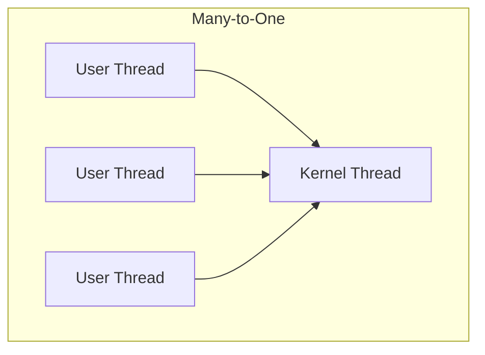

> [!NOTE] Definition
> Multithreading models define how user-level threads are mapped to kernel-level threads.

## The Three Models

### Many-to-One
- Many user threads map to **one** kernel thread
- Thread management is efficient (done in user space)
- One blocking call blocks all threads
- Cannot use multiple CPUs

### One-to-One
- Each user thread maps to **one** kernel thread
- True parallelism on multi-core systems
- Blocking one thread doesn't affect others
- Creating threads is more expensive (kernel involvement)
- Used by Linux and Windows

### Many-to-Many
- Many user threads map to **many** kernel threads (multiplexing)
- Flexible: OS can create enough kernel threads for the hardware
- Most complex to implement

## Related Concepts

- [[User-Level vs Kernel-Level Threads]]: the building blocks of these models
- [[Linux vs Windows Prozessmodell]]: how real OSes implement threading
