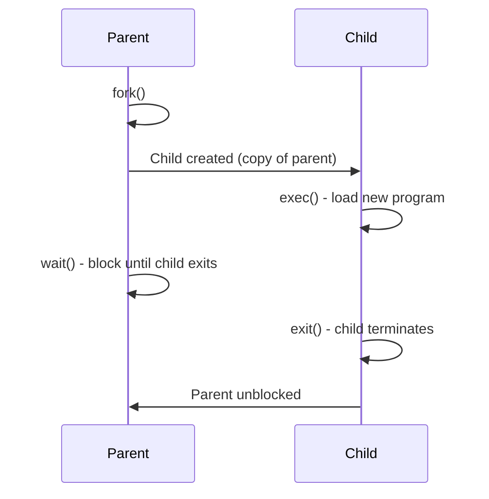

> [!NOTE] Definition
> POSIX defines a standard set of system calls for process management in UNIX-like systems.

## Core System Calls

| Syscall | Description |
|---------|-------------|
| `fork()` | Creates a copy of the calling process. Returns 0 in the child, the child's PID in the parent, negative on error |
| `exec()` | Loads a new program into the current process and starts executing it |
| `exit()` | Terminates the current process |
| `wait()` | Parent blocks until a child process terminates |
| `kill()` | Sends a signal to a process (can cause termination) |

## Typical Process Creation Flow

## Related Concepts

- [[System Calls]]: the general mechanism these calls use
- [[Prozesszustände]]: the states processes transition through
- [[Zombie und Orphan Prozesse]]: what happens when `wait()` is not called
