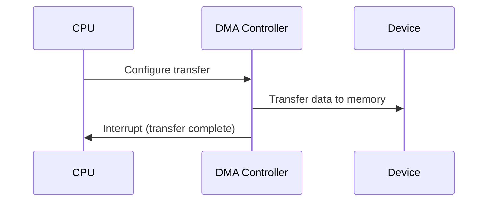

> [!NOTE] Definition
> **Programmed I/O** has the CPU actively poll the device status in a busy-wait loop. **Interrupt-driven I/O** blocks the process and uses an interrupt to signal completion.

## Comparison

| Aspect | Programmed I/O | Interrupt-driven I/O |
|--------|---------------|---------------------|
| CPU during I/O | Busy-waiting (polling) | Free to run other processes |
| Efficiency | Very low (wastes CPU cycles) | High (CPU does useful work) |
| Complexity | Simple | Requires interrupt handling |
| Latency | Low (immediate detection) | Slight delay (interrupt processing) |

## Direct Memory Access (DMA)

A third approach that further reduces CPU involvement:
- A DMA controller handles memory transfers independently
- The CPU only receives one interrupt when the entire I/O operation is complete
- Example: reading a block from disk directly into a buffer without CPU involvement

## Related Concepts

- [[Interrupts]]: the mechanism that makes interrupt-driven I/O work
- [[Device Drivers]]: software that interfaces with I/O devices
- [[Interrupt-Verarbeitung]]: how the CPU handles I/O completion interrupts
