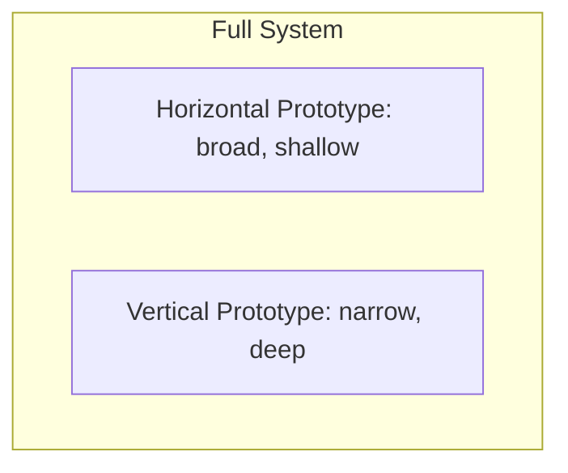

> [!NOTE] Definition
> A prototype is "a first or preliminary version of a device or vehicle from which other forms are developed" (Oxford Dictionary). In HCI, prototyping is an iterative process used for learning, searching for solutions, and communicating design ideas before committing to a final implementation.

## Goals of Prototyping

- **Learning** - discovering what works through hands-on experimentation
- **Searching** - exploring a wide space of possible designs before converging
- **Communicating** - making abstract ideas concrete enough to discuss with users and stakeholders

The guiding mindset is often summarized as *"Move fast! Break things! Fail fast!"* - prototypes are meant to be cheap to discard, not precious final artifacts.

## Low Fidelity vs. High Fidelity

| | Low Fidelity | High Fidelity |
|---|---|---|
| **Focus** | Elaboration (opportunity seeking) | Reduction (decision-making) |
| **Goal** | Quick visual exploration, capturing key interactions | Clearer understanding of functionality, closer to implementation |
| **Examples** | Storyboards, sketches, paper prototypes, roleplay, [[Wizard of Oz Prototyping|Wizard of Oz]] | Interactive wireframes, functional hardware, digital fabrication |
| **Audience** | Design team, early exploration | Decision makers, usability testing |

Design as a whole oscillates between **elaboration** (generating many candidate ideas) and **reduction** (narrowing down to a decision) as it moves forward - low fidelity prototyping tends to emphasize elaboration, high fidelity tends to emphasize reduction, though not always.

## Prototyping Methods

### Sketches

Sketching is not about drawing skill - it is a tool to express, develop, and communicate ideas, and a step in a process of idea generation, elaboration, choice, and engineering. Used early, when ideas are still cheap to change.

### Storyboards

Based on sketching techniques and heavily grounded in [[Personas]] and [[Scenarios in HCI|scenarios]]. A good storyboard shows not just static states but the **transitions** between them - how a user gets from one state to the next.

### Paper Prototypes

A physical mockup of the interface, usually hand-sketched across multiple pieces of paper representing different screens, menus, or dialogs. What distinguishes a paper prototype from a simple sketch is a degree of **interactivity**, achieved through dynamic paper elements (flaps, sticky notes) or a narrator acting out the interaction. Useful early in the process and for complex or critical problems where a working system would be too costly to build first.

### Wizard of Oz

See [[Wizard of Oz Prototyping]] - simulating system intelligence with a hidden human operator.

### Interactive Wireframes

Unlike storyboards, form builders use actual working widgets rather than static pictures, letting a team quickly build a visually horizontal prototype and add limited verticality through simple scripting. Built with dedicated tools (Figma, Adobe XD, Balsamiq) or even presentation software. Only applicable to the software side of a product.

### Hardware and Digital Fabrication

High-fidelity physical prototyping using tools like Arduino for functional electronics, or 3D printing and laser cutting for physical form factors - used when the product's physicality is central to the experience.

## Horizontal vs. Vertical Prototypes

A **horizontal prototype** implements many features at a shallow, non-functional level (e.g., a full click-through UI with no working logic). A **vertical prototype** implements a narrow slice of the product in full depth and functionality (e.g., one complete user flow that fully works end-to-end).

Most real projects combine multiple prototype types across a project's lifetime, mixing offline (paper, physical), hybrid, and online (software) manifestations to leverage the strengths of each.

## Rapid Prototyping for XR

For XR (AR/VR/MR) experiences, a rapid prototype often lets a team feel an interaction idea without implementing any real software, using cheap physical stand-ins such as a Google Cardboard viewer or even a bare smartphone to simulate the headset. **Haptic experiences are especially hard to prototype** because there is no cheap off-the-shelf haptic hardware, so research prototypes often substitute human actuation for machine actuation:

- **Haptic Turk**: other people physically move and support the user's body (e.g., lifting, pushing) in sync with VR content to simulate acceleration and collision forces
- **TurkDeck**: helpers manually reposition physical props around a VR user in real time so that what the user reaches for in the real world matches what they see in the headset
- Simple examples: timing two people to lift a seated user during a VR rollercoaster video to simulate ascent/descent, or using a hand gesture (e.g., "LandOn") to trigger a scripted event

The core idea is the same as [[Wizard of Oz Prototyping]] applied to physical sensation: a hidden human replaces missing hardware to test whether the *experience* works before investing in real actuators.

## Related Concepts

- [[Human-Centered Design Process]]: prototyping is the core activity of the "design solutions" stage
- [[Personas]] and [[Scenarios in HCI]]: the primary inputs that ground storyboards and prototypes in real user needs
- [[Wizard of Oz Prototyping]]: a specific low-fidelity technique for simulating functionality
