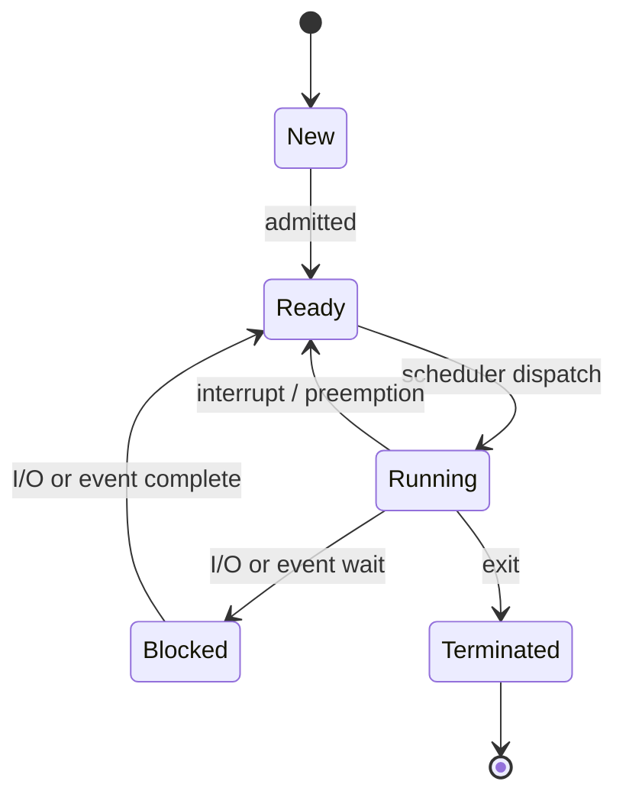

> [!NOTE] Definition
> Every process transitions through a set of defined states during its lifetime, managed by the OS scheduler.

## The Five States

| State | Description |
|-------|-------------|
| **New** | Process is being created |
| **Ready** | Process is waiting to be assigned to the CPU |
| **Running** | Process instructions are being executed |
| **Blocked** | Process is waiting for I/O or another event |
| **Terminated** | Process has finished execution (remains in table if parent hasn't called `wait()`) |

> [!IMPORTANT]
> A terminated process that hasn't been cleaned up becomes a [[Zombie und Orphan Prozesse|zombie process]], still occupying an entry in the process table.

## Related Concepts

- [[Process Control Block]]: stores the current state of a process
- [[Context Switch]]: how the OS transitions between running processes
- [[Zombie und Orphan Prozesse]]: special cases of terminated/orphaned processes
