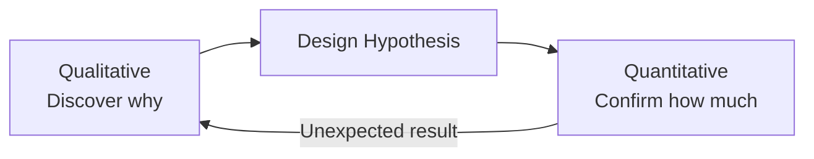

> [!NOTE] Definition
> Qualitative research gathers rich, descriptive, non-numerical data to understand *why* users behave a certain way, while quantitative research gathers numerical data to measure *how much* or *how often* something occurs.

## Comparison

| | Qualitative | Quantitative |
|---|---|---|
| **Goal** | Understand meaning, motivation, context | Measure frequency, magnitude, statistical patterns |
| **Data** | Text, observations, quotes, recordings | Numbers, ratings, counts, timings |
| **Typical methods** | [[Ethnography in HCI]], [[Interview Techniques in HCI\|interviews]], think-aloud protocols | Surveys, A/B tests, analytics, usability metrics |
| **Sample size** | Small (depth over breadth) | Large (breadth over depth) |
| **Output** | Themes, narratives, hypotheses | Statistics, significance tests, trends |

## Why Both Are Needed

Qualitative methods are exploratory - they generate hypotheses about *why* users struggle with a design. Quantitative methods are confirmatory - they test whether those hypotheses hold at scale and measure the size of an effect. Neither alone is sufficient: qualitative data risks anecdote-driven decisions, and quantitative data risks answering the wrong question precisely.

## Example

A team notices via analytics (quantitative) that 40% of users abandon a checkout form at the address field. Follow-up interviews and observation (qualitative) reveal *why*: users are confused by an ambiguous "Address Line 2" label. The fix is validated afterward with a quantitative A/B test measuring the new abandonment rate.

## Related Concepts

- [[Ethnography in HCI]]: a primary qualitative method
- [[Interview Techniques in HCI]]: a primary qualitative method
- [[Human-Centered Design Process]]: both research types feed the "specify context of use" and "specify user requirements" stages
