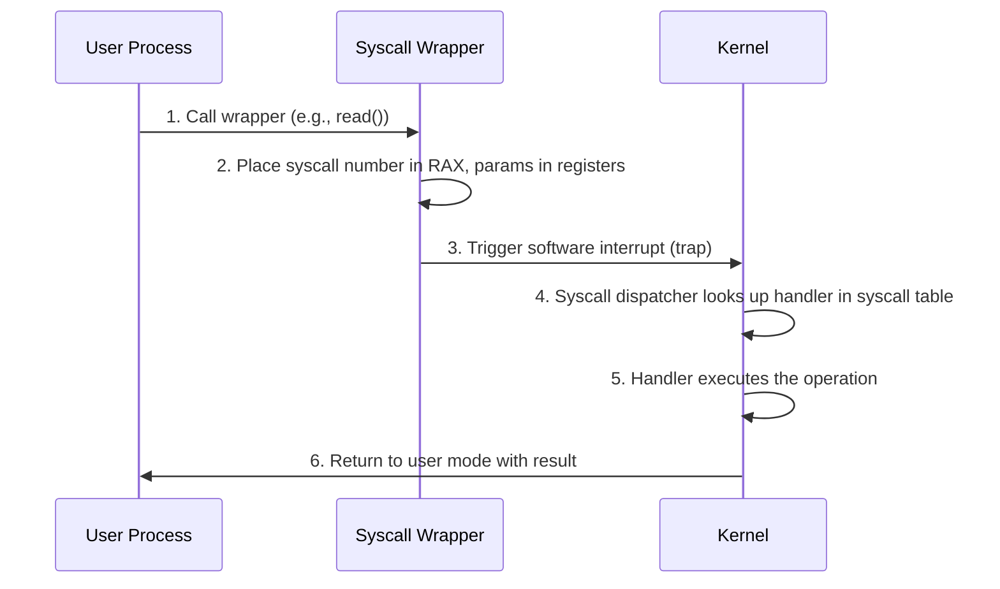

> [!NOTE] Definition
> System calls are requests from user-mode processes to the kernel for privileged operations such as I/O, memory allocation, or process creation.

## How a System Call Works

## Step-by-Step

1. Process calls a syscall wrapper from a standard library
2. Data is placed in designated registers so the kernel knows which operation is requested
3. The process throws an exception (trap function) to hand control to the kernel
4. The syscall dispatcher checks the syscall table for the matching handler
5. The handler executes the requested operation, places output in registers
6. Control returns to the calling process in user mode

## Common System Calls

| Category | Examples |
|----------|----------|
| Process | `fork()`, `exec()`, `exit()`, `wait()` |
| File | `open()`, `read()`, `write()`, `close()` |
| Memory | `mmap()`, `brk()` |
| Device | `ioctl()` |

## Related Concepts

- [[User Mode und Kernel Mode]]: the privilege boundary that syscalls cross
- [[POSIX Prozessverwaltung]]: UNIX-specific process syscalls
- [[Interrupts]]: the mechanism used to trigger mode switches
