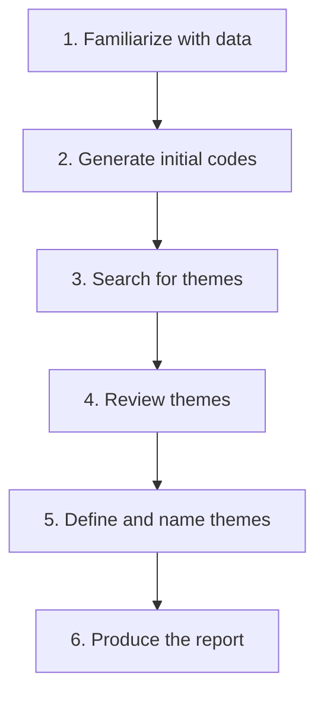

> [!NOTE] Definition
> Thematic analysis is a method for systematically identifying, coding, and organizing recurring patterns (themes) across qualitative data such as interview transcripts or observation notes.

## The Six-Step Process

1. **Familiarize with the data** - read and re-read transcripts/notes to get an overall sense
2. **Generate initial codes** - label meaningful segments of the data systematically
3. **Search for themes** - group related codes into candidate overarching themes
4. **Review themes** - check themes against the coded extracts and the full dataset for coherence
5. **Define and name themes** - clearly articulate what each theme captures and why it matters
6. **Produce the report** - write up the analysis with supporting quotes and evidence

## When to Use It

Thematic analysis is the standard way to turn qualitative data (from [[Interview Techniques in HCI|interviews]], [[Ethnography in HCI|observations]], or open-ended survey responses) into structured, reportable findings, complementing quantitative analysis such as [[Descriptive Statistics]] and [[Statistical Significance Testing]].

## Related Concepts

- [[Qualitative vs Quantitative Research Methods]]: thematic analysis is the primary analysis method for qualitative data
- [[Interview Techniques in HCI]]: a common data source thematic analysis is applied to
- [[Controlled Experiment]]: qualitative and quantitative analysis are often combined in a single study
