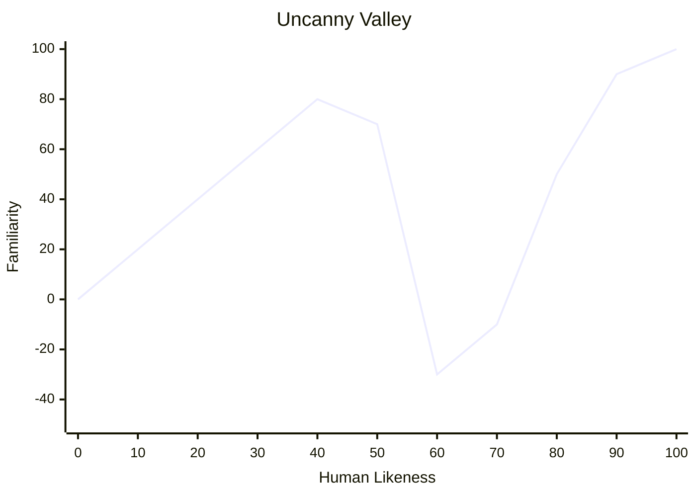

> [!NOTE] Definition
> The Uncanny Valley describes the phenomenon where empathy and familiarity with non-human objects increases steadily as they become more human-like, but drops sharply into a "valley" of revulsion just before achieving full human likeness.

## The Effect

As robots or CGI characters are designed to look increasingly human:
- Familiarity and empathy increase steadily at first
- Near-perfect but not quite human appearance causes a drastic drop - objects appear deeply disturbing
- Only when true indistinguishability is reached does familiarity recover

> [!IMPORTANT]
> This effect is critical for character design in games, films, and robotics. Stylized or clearly non-human designs often receive better emotional responses than near-photorealistic attempts.

## Related Concepts

- [[Graphics Pipeline]]: the rendering technology producing these visual representations
- [[User-Centered Design]]: designing with human emotional responses in mind
