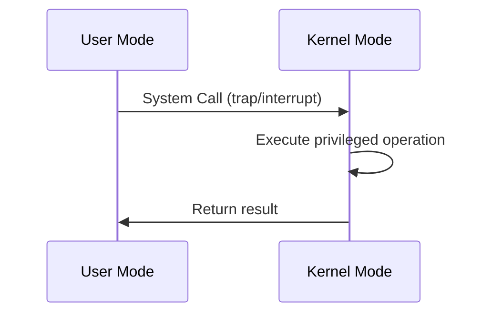

> [!NOTE] Definition
> Modern operating systems use two execution modes to protect the system: **User Mode** for applications and **Kernel Mode** for the OS itself.

## Comparison

| Aspect | User Mode (Ring 3) | Kernel Mode (Ring 0) |
|--------|-------------------|---------------------|
| Privilege | Restricted | Full hardware access |
| I/O Access | Not allowed directly | Direct I/O and memory access |
| Crash Impact | Only the process crashes | Entire system can crash |
| Transition | Via [[System Calls]] | Via interrupt return |

## Mode Switching

When a user-mode process needs a privileged operation (e.g., reading a file), it must perform a [[System Calls|system call]], which triggers a controlled transition to kernel mode:

> [!WARNING]
> Code running in kernel mode has unrestricted access. A bug in kernel code can compromise the entire system, which is why [[Microkernel|microkernels]] try to minimize kernel-mode code.

## Related Concepts

- [[x86 Schutzringe]]: the hardware mechanism behind privilege levels
- [[System Calls]]: the interface for crossing the mode boundary
