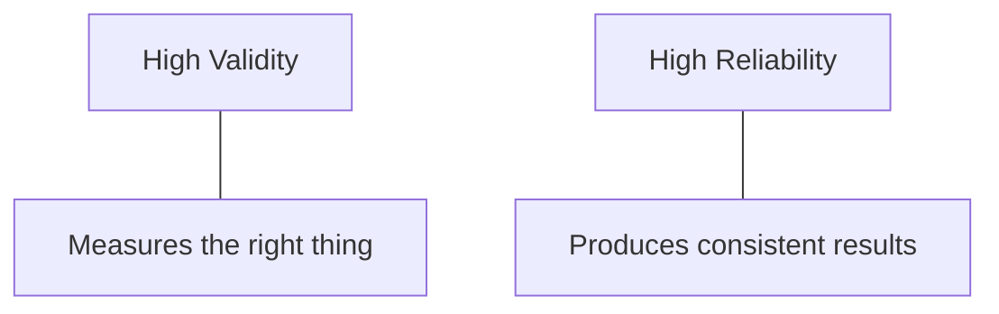

> [!NOTE] Definition
> Validity is the extent to which a study actually measures what it claims to measure and its results can be trusted to reflect a true causal effect. Reliability is the extent to which a study produces consistent results when repeated.

## Internal Validity

The degree to which the observed effect on the dependent variable can be confidently attributed to the independent variable, rather than to a [[Control, Random, and Confounding Variables|confounding variable]] or flaw in the study design. High internal validity requires tight control of the experimental setting - which is why lab experiments tend to have higher internal validity than field studies.

## External Validity

The degree to which the results **generalize** beyond the specific study setting - to other populations, environments, or tasks. High external validity requires realistic conditions - which is why field studies tend to have higher external validity than lab experiments.

> [!IMPORTANT]
> Internal and external validity are often in tension: the tighter the control needed for internal validity, the less the setting resembles real-world use, which reduces external validity. Study design is partly about deliberately choosing a point on this tradeoff.

## Reliability

Whether repeating the same study (same procedure, same measures) under the same conditions produces consistent results. A study can be reliable (consistent) without being valid (measuring the right thing) - for example, a broken stopwatch that reads 10 seconds too fast every time is perfectly reliable but not valid for measuring true task time.

## Related Concepts

- [[Controlled Experiment]]: the study format whose quality these two properties describe
- [[Control, Random, and Confounding Variables]]: the main threat to internal validity
- [[Between-Subjects and Within-Subjects Design]]: the choice of design affects both validity properties differently
