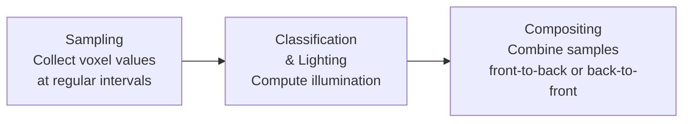

> [!NOTE] Definition
> Volume rendering visualizes 3D scalar fields (e.g., from CT/MRI scans) either by extracting intermediate surface representations (indirect) or by rendering the volume data directly.

## Indirect Volume Visualization

Generates an intermediate polygonal representation of the volume:

- Complexity depends on **number of polygons**
- Examples: [[Marching Squares]] (2D), Marching Cubes (3D)

## Direct Volume Visualization

Renders the volumetric data without generating an intermediate mesh:

- Complexity depends on **number of voxels** and display resolution
- Examples: Density Emitter Model, Raycasting

## Volume Rendering Pipeline

### Compositing Order

| Order | Description |
|-------|-------------|
| **Front-to-back** | Better quality, preferred approach |
| **Back-to-front** | Simpler but less efficient |

## Transfer Function

Maps sampled scalar values to optical properties (color, opacity/transparency). This is the key user-controllable element for exploring volumetric data.

> [!IMPORTANT]
> Transfer functions are used to assign optical properties like transparency or color to scalar values in volumetric data.

## Related Concepts

- [[3D Data Acquisition]]: sources of volumetric data (CT, MRI)
- [[Marching Squares]]: indirect visualization algorithm
- [[Mesh Processing]]: post-processing extracted surfaces
