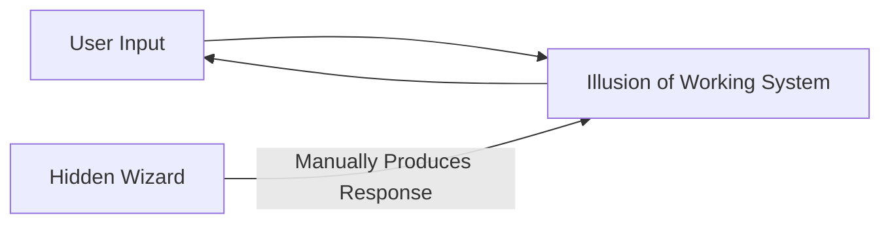

> [!NOTE] Definition
> Wizard of Oz (WoZ) prototyping is a technique in which a hidden human operator ("the wizard") simulates the behavior of a system, creating the illusion for the user that a fully functioning system exists, without the underlying functionality actually being implemented.

## How It Works

A combination of partially functional technology and human improvisation ("acting") creates a convincing facade. A hidden operator observes the user's input, often through a control panel, and manually produces the system's responses in real time.

## When to Use It

WoZ is valuable when a concept is worth testing with real users, but implementing the real functionality would take too much time or is not yet technically feasible - it lets teams learn from user reactions before committing engineering effort.

## Example

Testing a voice-to-text interface at a time before natural language processing was reliable: one researcher spoke into a microphone while a hidden second researcher manually typed the "recognized" text, giving the test participant the impression of a working speech recognition system.

> [!IMPORTANT]
> Wizard of Oz prototyping tests the user experience and concept viability, not the technical feasibility of building the real system - a positive WoZ result does not guarantee the final implementation will be equally responsive.

## Related Concepts

- [[Prototyping in HCI]]: Wizard of Oz is one specific low/mixed-fidelity prototyping technique
- [[Human-Centered Design Process]]: used during the "design solutions" stage to validate concepts cheaply
