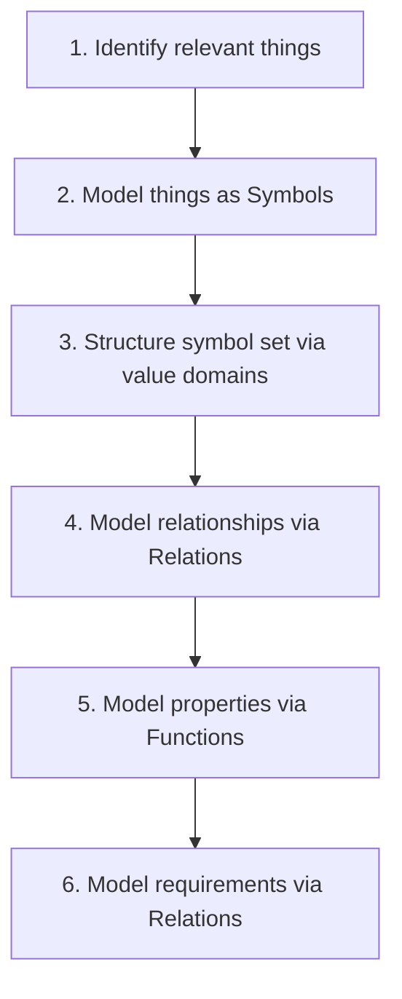

> [!NOTE] Definition
> Formal modeling follows a structured six-step process to translate real-world systems into precise mathematical models.

## The Six Steps

## Specification with Logic

Models can be specified using different formal languages:

| Formalism | Notation |
|-----------|----------|
| Regular language (semantics) | $L(\ldots) := (\{a\} \circ \{b\}) \circ (\{a\} \circ \{b\})^*$ |
| Regular expression | $E := ((a(a+b)^*))b)$ |
| Regular grammar | $G := (\Sigma, V, X_0, P)$ |
| DFA/NFA | $A := (\Sigma, Q, \delta, q_0, F)$ |

## Related Concepts

- [[Sets and Functions in MOSES]]: the mathematical foundation for modeling
- [[Relations and Orderings]]: step 4 and 6 use relations
- [[Aussagenlogik]]: logic used for specifying properties
- [[Prädikatenlogik]]: first-order logic for richer specifications
