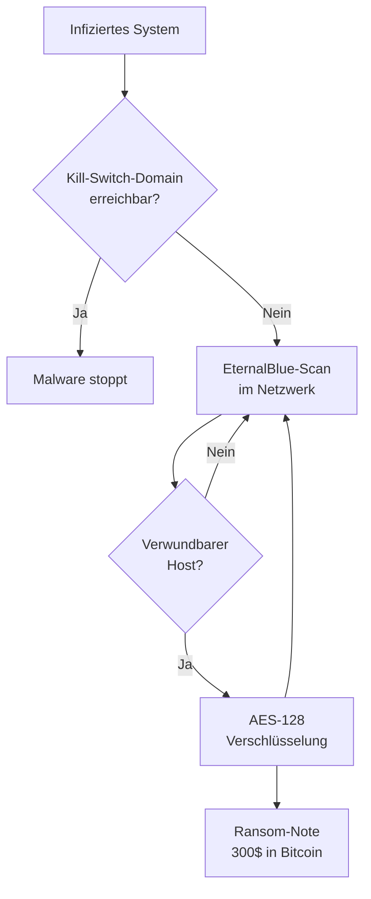

# WannaCry

**WannaCry** (Mai 2017) war ein weltweiter Ransomware-Angriff, der innerhalb weniger Tage über 200.000 Systeme in 150 Ländern befiel. Besondere Relevanz erlangte er durch die Nutzung eines NSA-Exploits und das Vorhandensein eines *Kill Switch*.

## Funktionsweise

1. **Exploit:** Nutzt **EternalBlue** (CVE-2017-0144) — einen von der NSA entwickelten und durch die Hackergruppe *Shadow Brokers* geleakten Exploit für **SMBv1**
2. **Wurmverhalten:** Scannt aktiv nach weiteren verwundbaren Hosts im Netzwerk und verbreitet sich selbstständig (kein Benutzerinteraktion nötig)
3. **Payload:** Verschlüsselt Dateien mit AES-128, fordert Lösegeld in Bitcoin ($300–$600)

## Kill Switch

Sicherheitsforscher **Marcus Hutchins** entdeckte, dass die Malware vor der Ausführung eine hardcodierte Domain abfragt. Da diese nicht registriert war, registrierte er sie — und stoppte damit die globale Ausbreitung. Dies war kein echter Schutz, sondern vermutlich ein Anti-Sandbox-Mechanismus der Entwickler.

## Schäden

- **NHS (UK):** Krankenhäuser mussten Patienten abweisen, Operationen wurden abgesagt
- **Telefónica, Deutsche Bahn, Renault** u. v. m. betroffen
- Gesamtschaden: **$4–8 Mrd.**

## Zuschreibung

USA, UK und andere Staaten machten die nordkoreanische Hackergruppe **Lazarus Group** verantwortlich.

## Warum war der Patch vorhanden, aber nicht eingespielt?

Microsoft hatte **MS17-010** bereits im März 2017 veröffentlicht — zwei Monate vor dem Angriff. Viele Organisationen, insbesondere im öffentlichen Sektor, betrieben jedoch veraltete oder ungepatchte Windows-Systeme (teils noch XP).

## Zusammenhang

- Nutzt denselben Exploit ([[EternalBlue]]) wie [[NotPetya]]
- Shadow-Brokers-Leak als gemeinsamer Ursprung beider Angriffe
