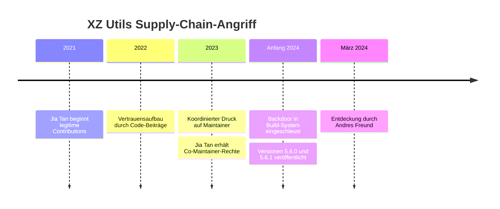

# XZ Utils Attack (CVE-2024-3094)

Im März 2024 entdeckte Microsoft-Entwickler **Andres Freund** zufällig eine Backdoor in den Versionen 5.6.0 und 5.6.1 von **XZ Utils** — einem weit verbreiteten Kompressionswerkzeug in Linux-Distributionen. Der Angriff gilt als einer der elaboriertesten Supply-Chain-Angriffe der Geschichte.

## Angriffsverlauf

Der Angreifer, bekannt unter dem Pseudonym **Jia Tan** (`JiaT75`), führte einen **mehrjährigen Social-Engineering-Angriff** durch:

1. **2021:** Jia Tan beginnt, legitime Beiträge zum XZ-Projekt zu leisten — unauffällig und qualitativ hochwertig
2. **2022–2023:** Aufbau von Vertrauen; Druck auf den Maintainer (Lasse Collin) durch koordinierte Beschwerden über angeblich langsame Entwicklung
3. **2023:** Jia Tan erhält Co-Maintainer-Rechte
4. **Anfang 2024:** Schrittweise Einschleusung der Backdoor in den Build-Prozess (versteckt in Testdateien als Binär-Blob)

## Technische Umsetzung der Backdoor

- Modifiziertes Build-System (CMake/Autotools) injiziert bösartigen Code nur unter bestimmten Bedingungen (Linux, `systemd`, Debian/RPM-Pakete)
- Backdoor ersetzt Funktionen in **liblzma**, die von **OpenSSH via systemd** geladen werden
- Ziel: Umgehung der **RSA-Authentifizierung** in sshd — ermöglicht unautorisierte Remote-Code-Ausführung mit dem privaten Schlüssel des Angreifers

## Entdeckung

Andres Freund fiel auf, dass `ssh`-Logins auf seinem System ~500 ms langsamer geworden waren und `sshd` unerwartet hohe CPU-Last erzeugte. Gründliche Analyse führte zur Backdoor.

## Auswirkungen

- Betroffen: Bleeding-Edge-Versionen von Fedora Rawhide, Debian Unstable/Testing, openSUSE Tumbleweed
- Stable-Releases der meisten Distributionen **nicht** betroffen (Rolling-Release-Distributionen zuerst)
- Keine bekannten Kompromittierungen, da rechtzeitig entdeckt

## Lektionen

- **Open Source ≠ automatisch sicher** — Maintainer sind oft Einzelpersonen ohne umfangreiche Review-Prozesse
- Langfristig aufgebautes Vertrauen kann zur Waffe werden
- Binary Blobs in Repositories sind schwer zu auditieren
- Anomalie-Erkennung (ungewöhnliche Latenz) kann Angriffe aufdecken
