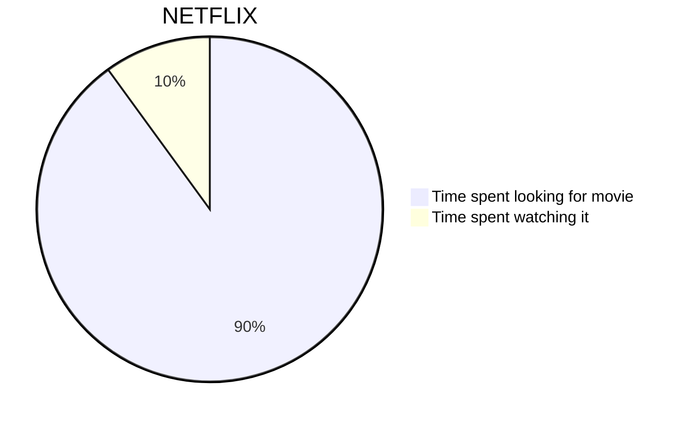
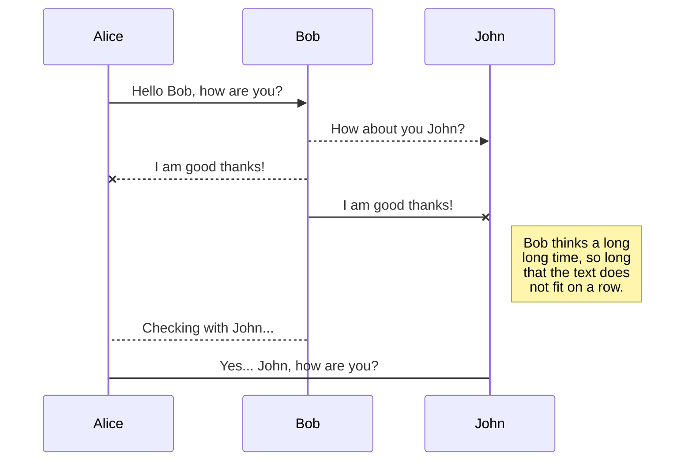
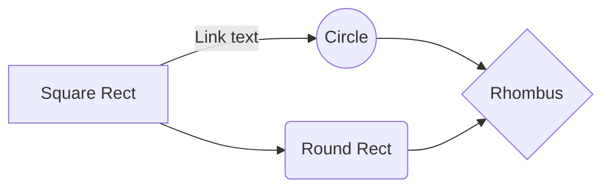
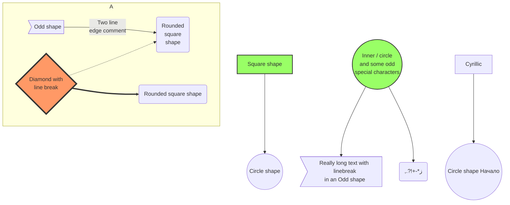
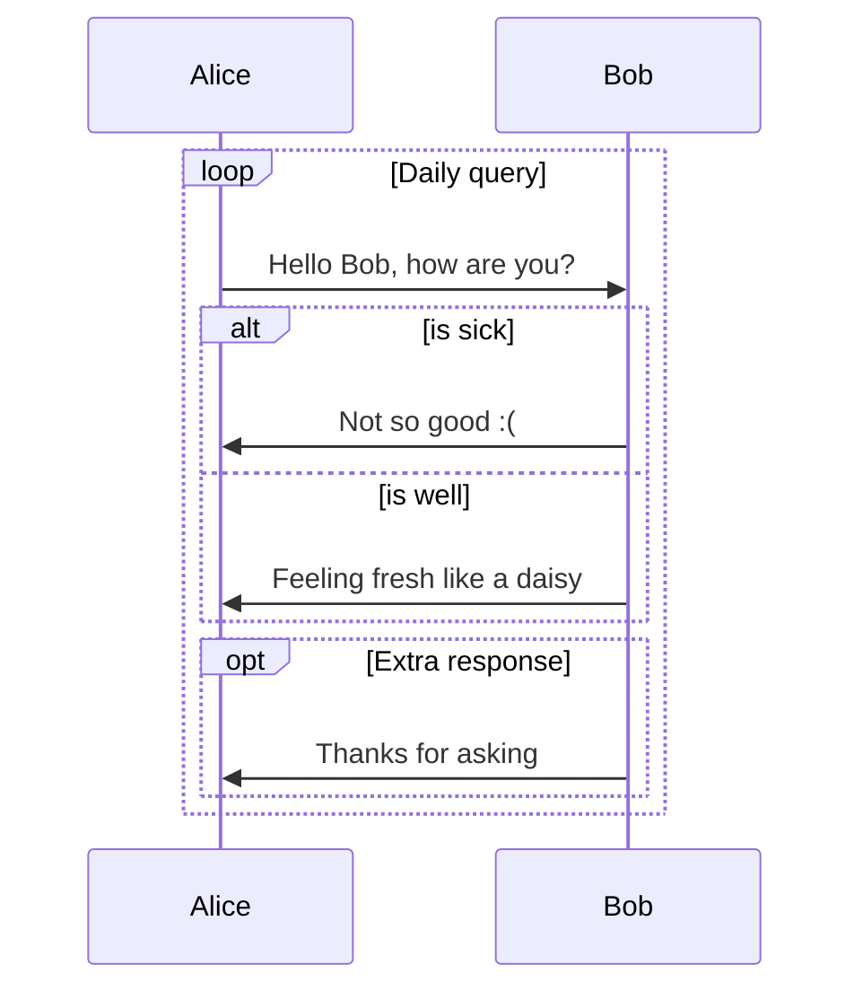
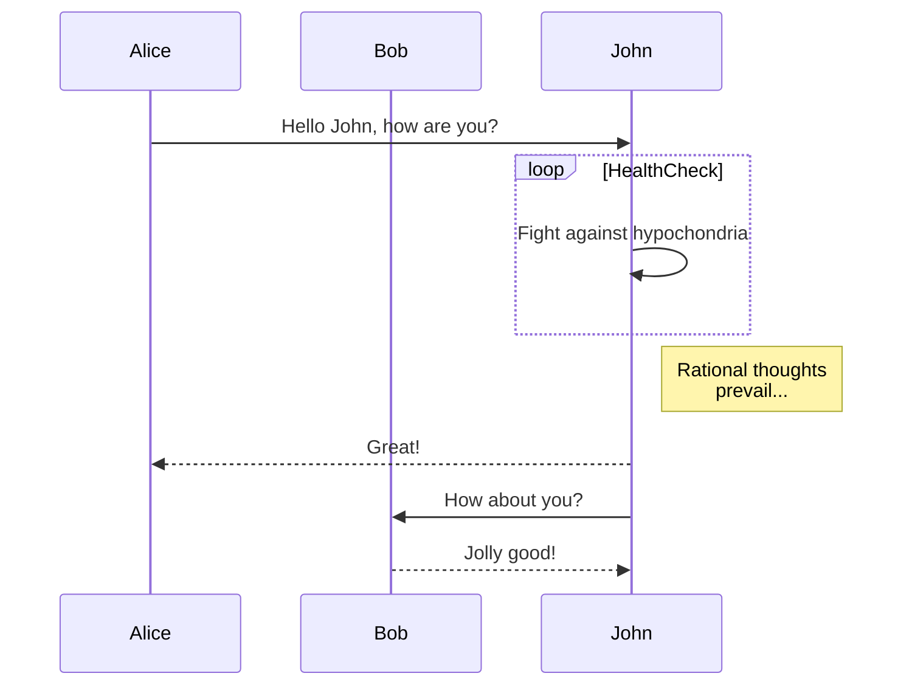
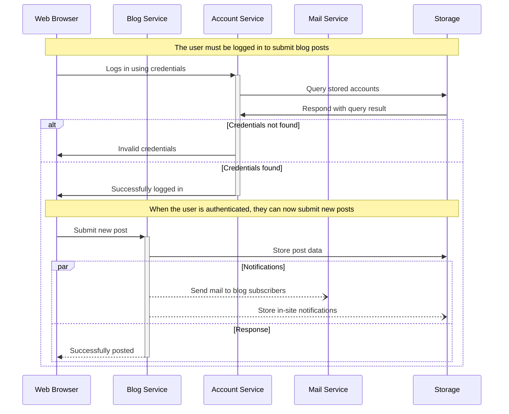
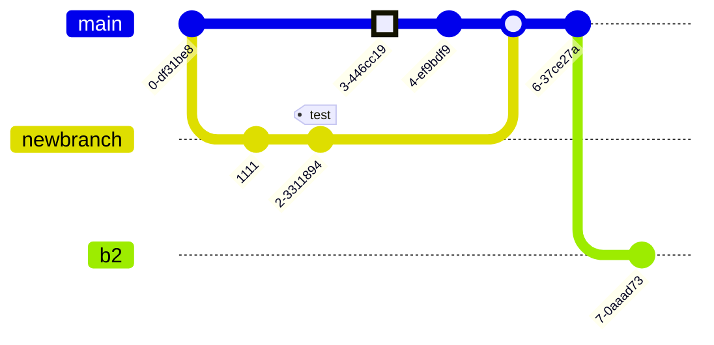

Quartz unterstützt die alle [obsidian](https://obsidian.md/help/obsidian-flavored-markdown) und [github](https://docs.github.com/en/get-started/writing-on-github/getting-started-with-writing-and-formatting-on-github/basic-writing-and-formatting-syntax) flavored markdown synatax.

Hier ein paar praktische syntax

Here is a simple footnote[^1].

A footnote can also have multiple lines[^2].

[^1]: My reference.
[^2]: To add line breaks within a footnote, add 2 spaces to the end of a line.  
This is a second line.

> [!NOTE]
> Useful information that users should know, even when skimming content.

> [!TIP]
> Helpful advice for doing things better or more easily.

> [!IMPORTANT]
> Key information users need to know to achieve their goal.

> [!WARNING]
> Urgent info that needs immediate user attention to avoid problems.

> [!CAUTION]
> Advises about risks or negative outcomes of certain actions.

<!-- This content will not appear in the rendered Markdown -->
  $$z = \sum_{i=1}^{n} w_i x_i + b = \mathbf{w}^\top \mathbf{x} + b$$

